## Setup AMP Target


```
apt update && apt dist-upgrade -y
apt install curl -y
```

```
nano /etc/fstab
```

Add the following line to the end of the file

```
proc    /proc    proc    defaults,hidepid=2     0     0
```

```
systemctl reboot
```

```
bash <(curl -fsSL getamp.sh)
```

Enter your admin username and password

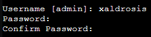

Select yes to install the docker components

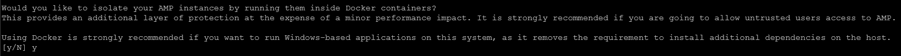

Select no to not configure https

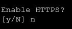

Press enter to start the installation

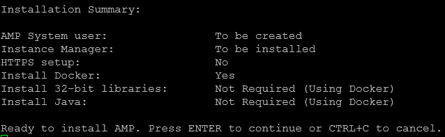

Open your browser and visit http://ip:8080 and login with the user created during the setup

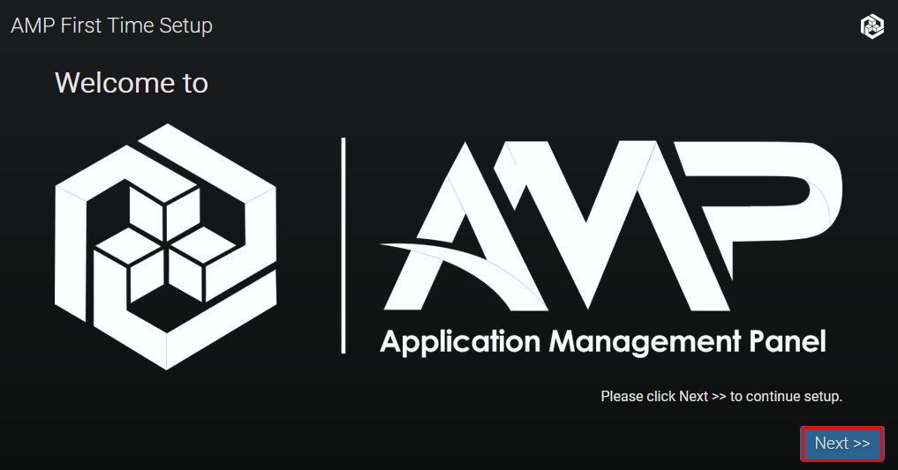

Enter your license key

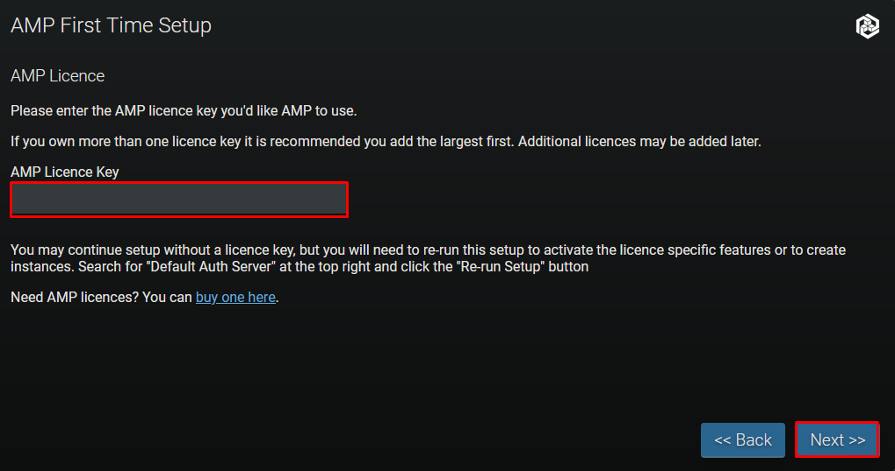

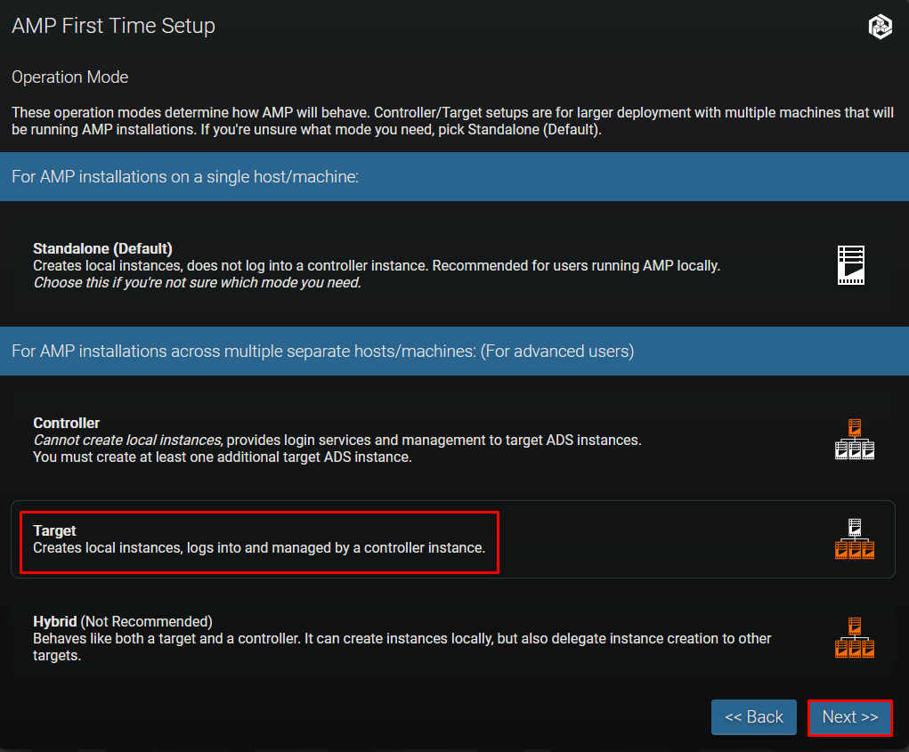

Log on to your controller and select Pair new target

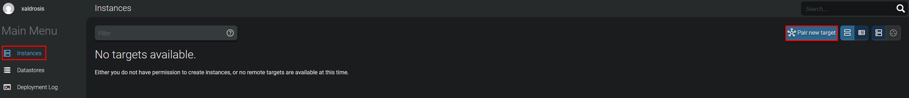

Copy the code

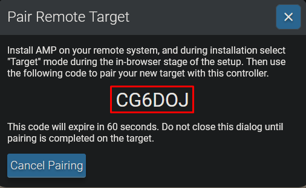

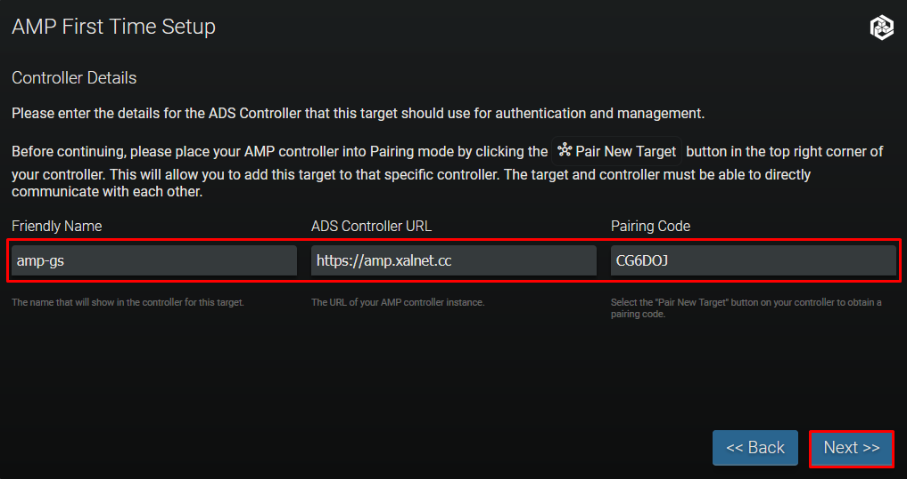

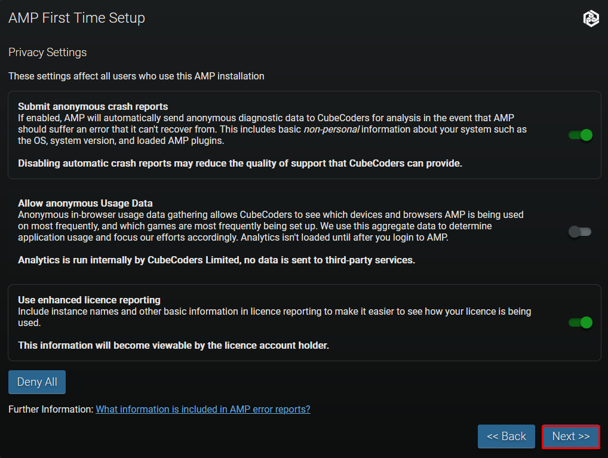

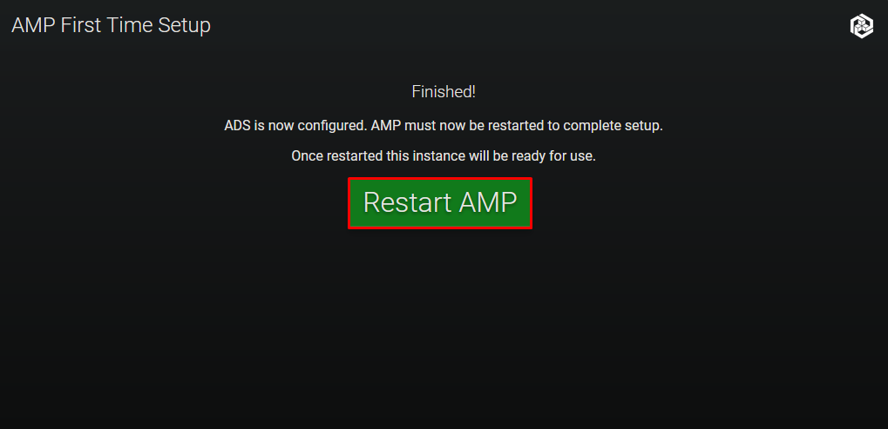

## Setup Let's Encrypt

```
curl https://get.acme.sh | sh
mkdir -p /etc/letsencrypt/live/amp-gs.home.xalnet.cc
export CF_Token="CloudflareToken"
export CF_Email="Email"
cd /root/.acme.sh
./acme.sh --issue --dns dns_cf -d "amp-gs.home.xalnet.cc" --server letsencrypt \
--key-file /etc/letsencrypt/live/amp-gs.home.xalnet.cc/privkey.pem \
--fullchain-file /etc/letsencrypt/live/amp-gs.home.xalnet.cc/fullchain.pem
```

## Setup NGINX reverse proxy


```
apt install nginx -y
rm /etc/nginx/sites-enabled/default
nano /etc/nginx/sites-available/amp.conf
```

```
server {
    listen 80;
    listen [::]:80;
    
    server_name amp-gs.home.xalnet.cc;

    if ($host = amp-gs.home.xalnet.cc) {
        return 301 https://$host$request_uri;
    }

    return 404;
}

server {
    listen 443 ssl http2;
    listen [::]:443 ssl http2;

    server_name amp-gs.home.xalnet.cc;

    # Replace the below as appropriate according to certificate locations and
    # whatever SSL settings you want. The below reflects a standard certbot
    # configuration
    ssl_certificate /etc/letsencrypt/live/amp-gs.home.xalnet.cc/fullchain.pem;
    ssl_certificate_key /etc/letsencrypt/live/amp-gs.home.xalnet.cc/privkey.pem;
    ssl_session_cache shared:SSL:10m;
    ssl_protocols TLSv1.2 TLSv1.3;
    ssl_ciphers "ECDHE-ECDSA-AES128-GCM-SHA256:ECDHE-RSA-AES128-GCM-SHA256:ECDHE-ECDSA-AES256-GCM-SHA384:ECDHE-RSA-AES256-GCM-SHA384:ECDHE-ECDSA-CHACHA20-POLY1305:ECDHE-RSA-CHACHA20-POLY1305:DHE-RSA-AES128-GCM-SHA256:DHE-RSA-AES256-GCM-SHA384";
    ssl_prefer_server_ciphers on;
    
    location / {
        proxy_pass http://localhost:8080;  # Or whatever local IP and port ADS is listening on
        proxy_set_header        Host $host;
        proxy_set_header        X-Real-IP $remote_addr;
        proxy_set_header        X-Forwarded-For $proxy_add_x_forwarded_for;
        proxy_set_header        Upgrade $http_upgrade;
        proxy_set_header        Connection "Upgrade";
        proxy_set_header        X-AMP-Scheme $scheme;
        proxy_read_timeout      86400s;
        proxy_send_timeout      86400s;
        proxy_http_version      1.1;
        proxy_redirect          off;
        proxy_buffering         off;
        client_max_body_size    10240M;

        # The following nine lines will only work if nginx and AMP are on the same host
        error_page 502 /NotRunning.html;
        location = /NotRunning.html {
            root /opt/cubecoders/amp/shared/WebRoot;
            internal;
        }

        location /shared/ {
            alias /opt/cubecoders/amp/shared/WebRoot/;
        }
    }
}
```

```
ln -s /etc/nginx/sites-available/amp.conf /etc/nginx/sites-enabled/amp.conf
systemctl restart nginx
```