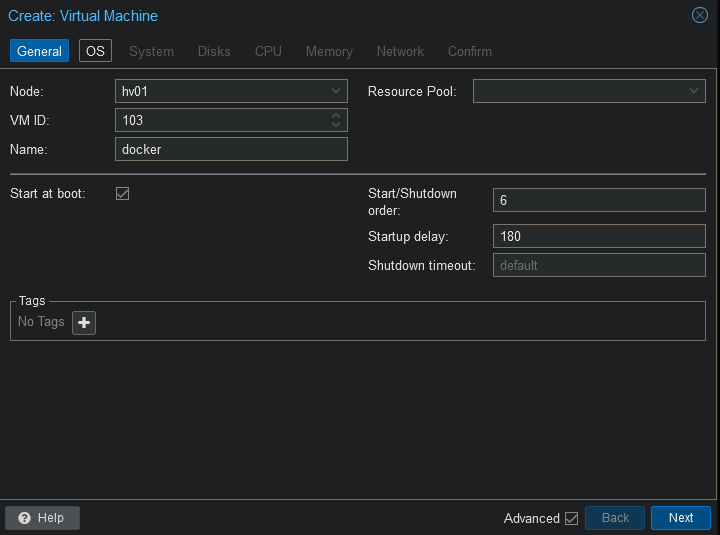
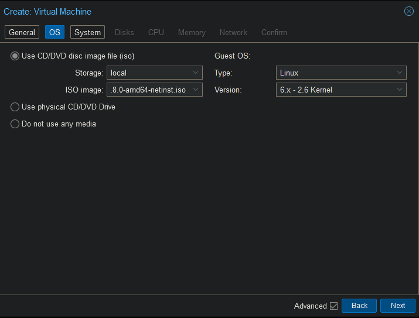
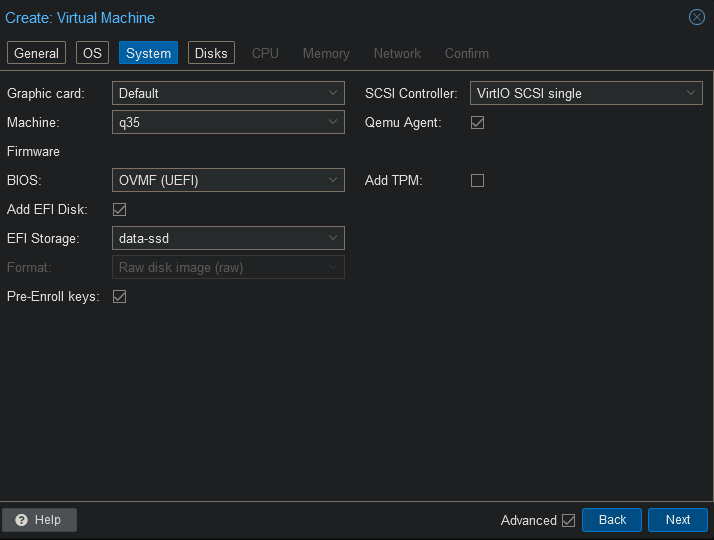
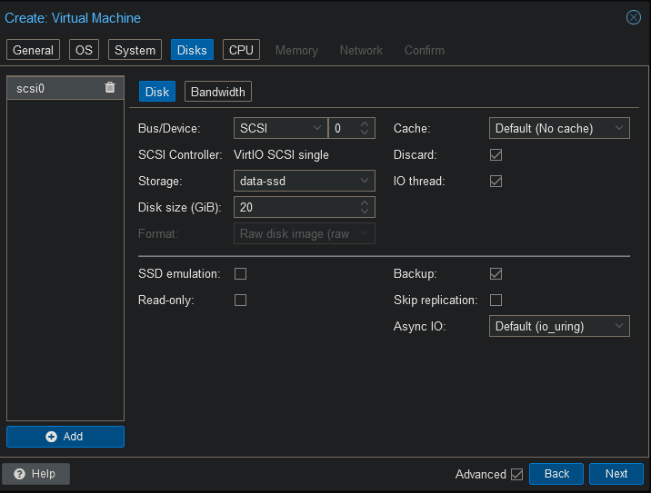
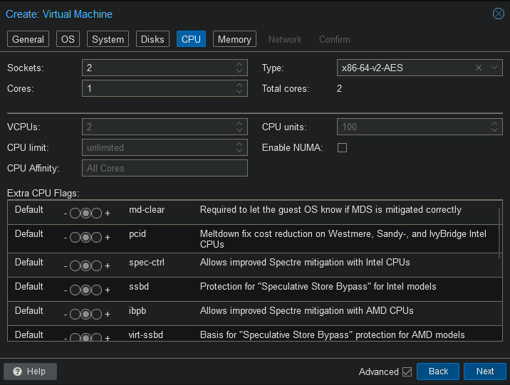
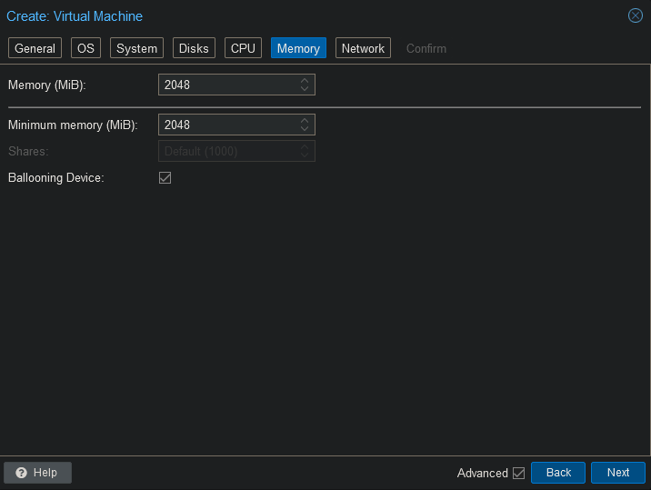
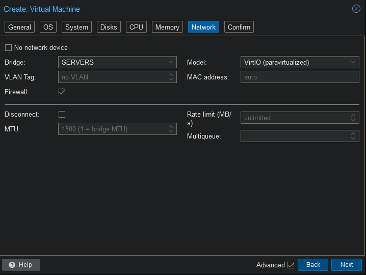

 
### VM Configuration

Due to restrictions on NFS and docker inside of an LXC we will be using a VM.















Install your favorite Linux distribution. I will be choosing for Debian.

### Create NFS user

```
apt install adduser sudo
sudo usermod -aG sudo steven
sudo useradd -u 3000 truenas --no-create-home
```
### Install Docker

Connect to the container's shell.

```
apt update
apt upgrade -y
```

```
apt install ca-certificates curl -y
install -m 0755 -d /etc/apt/keyrings
curl -fsSL https://download.docker.com/linux/debian/gpg -o /etc/apt/keyrings/docker.asc
chmod a+r /etc/apt/keyrings/docker.asc
```

```
echo \
  "deb [arch=$(dpkg --print-architecture) signed-by=/etc/apt/keyrings/docker.asc] https://download.docker.com/linux/debian \
  $(. /etc/os-release && echo "$VERSION_CODENAME") stable" | \
  tee /etc/apt/sources.list.d/docker.list > /dev/null
apt update
```

```
apt install docker-ce docker-ce-cli containerd.io docker-buildx-plugin docker-compose-plugin -y
```
