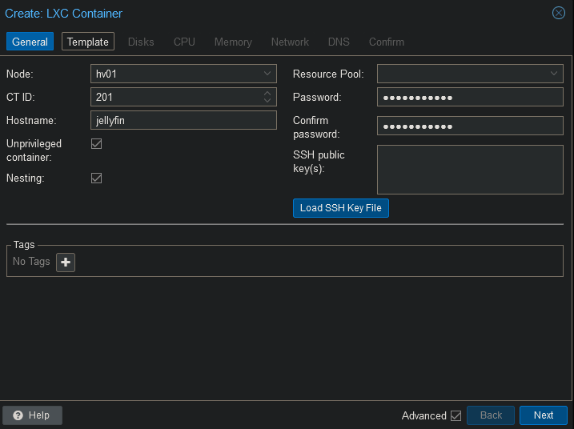
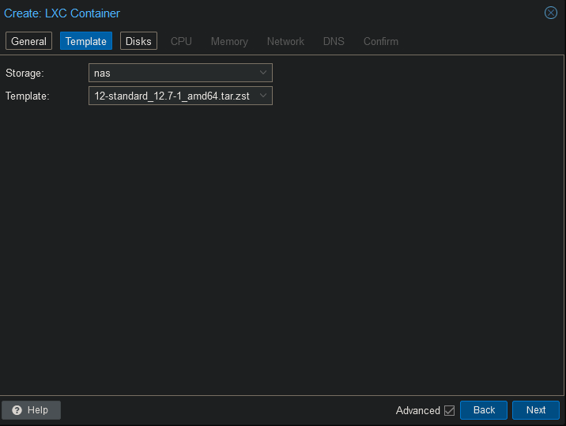
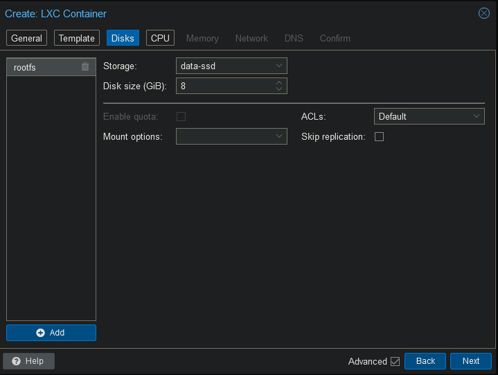
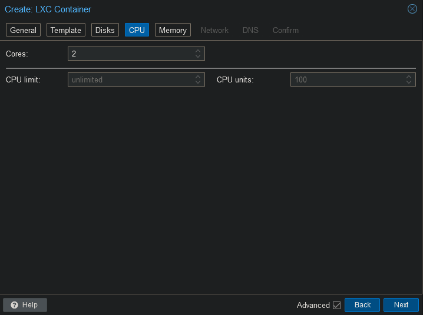
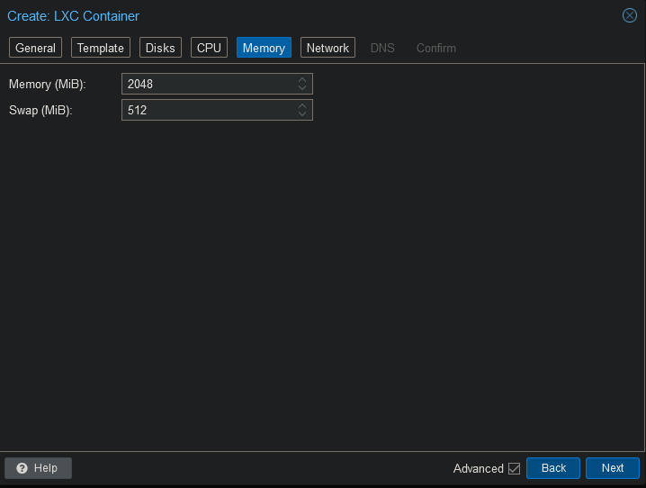
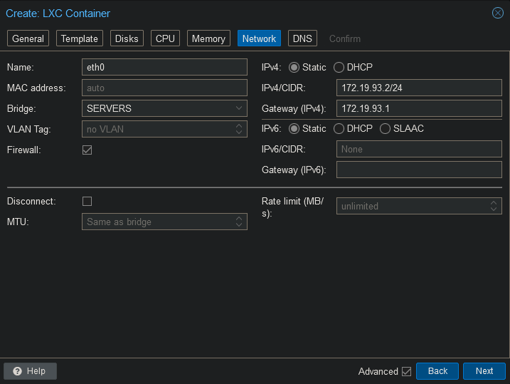
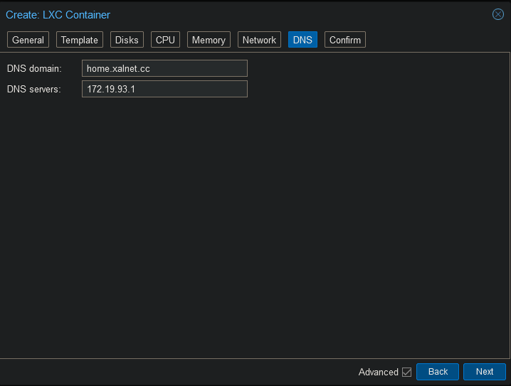

 
### LXC Configuration















### Add mountpoint

Open the shell on the Proxmox host and run the following command. Change the id to whatever id your container has.

```
pct set 201 -mp0 /mnt/pve/nas/video,mp=/mnt/video
pct set 201 -mp1 /mnt/pve/nas/cache/jellyfin,mp=/mnt/cache
```

### Add iGPU

Open the shell on Proxmox and run the following command.

```
nano /etc/pve/lxc/201.conf
```

Add the following to the end of the file and save.

```
dev0: /dev/dri/card0,gid=44,uid=0
dev1: /dev/dri/renderD128,gid=104,uid=0
```

### Install Jellyfin

Connect to the container's shell.

```
apt update
apt upgrade -y
```

Install the dependencies.

```
apt install curl sudo gpg mc -y
```

Install the following drivers.

```
apt install va-driver-all ocl-icd-libopencl1 intel-opencl-icd vainfo intel-gpu-tools -y
```

Run the install script to start your Jellyfin installation.

```
curl https://repo.jellyfin.org/install-debuntu.sh | bash
```

Press "Enter" again to start the installation.


