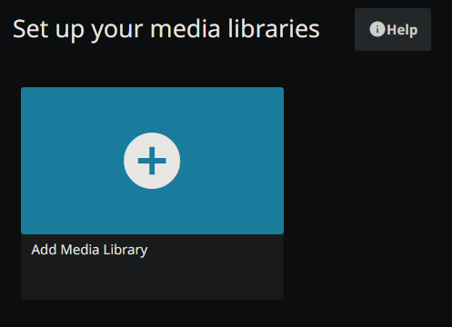

Select your language.

Choose your admin username and password.

Click on "Add Media Library".

Set the content type, displayname and add the folder.

Enable trickplay.

Now do the same for Movies.

Set the metadata language.

Set up remote access.

Log on with the created user and click your profile.

Click on "Dashboard".

Change the cache path. Scroll down and click on "Save".

Change the following settings for Transcoding.

Now enable hardware decoding for trickplay.

