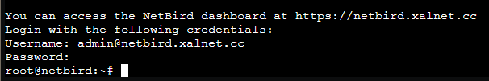

Make sure you already have setup your DNS record and forward the following ports to the VM/CT.

TCP
- 80
- 443
- 33073
- 10000
- 33080

UDP
- 3478
- 49152-65535

```
apt install sudo curl jq -y
```

```
apt install ca-certificates curl -y
install -m 0755 -d /etc/apt/keyrings
curl -fsSL https://download.docker.com/linux/debian/gpg -o /etc/apt/keyrings/docker.asc
chmod a+r /etc/apt/keyrings/docker.asc
```

```
echo \
  "deb [arch=$(dpkg --print-architecture) signed-by=/etc/apt/keyrings/docker.asc] https://download.docker.com/linux/debian \
  $(. /etc/os-release && echo "$VERSION_CODENAME") stable" | \
  tee /etc/apt/sources.list.d/docker.list > /dev/null
apt update
```

```
apt install docker-ce docker-ce-cli containerd.io docker-buildx-plugin docker-compose-plugin -y
```

```
export NETBIRD_DOMAIN=netbird.xalnet.cc; curl -fsSL https://github.com/netbirdio/netbird/releases/latest/download/getting-started-with-zitadel.sh | bash
```

You can now log onto the dashboard to configure your user account using the credentials from the console.

