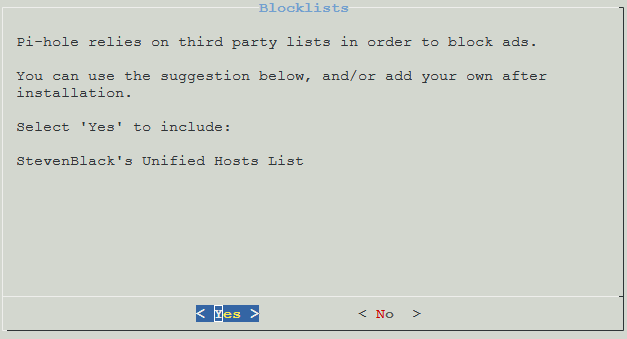

 
We will be installing pi-hole onto the container we created during the manual of LXC in the Proxmox section.

Run the following commands into the shell of the container

```
apt install curl -y
curl -sSL https://install.pi-hole.net | bash
```

Press "Enter" to start the setup.


As the container already has a static IP address, select "Continue" and press "Enter".


Select "Custom" and press "Enter".


Enter your preferred upstream DNS providers. As I both want to use cloudflare and quad9 I have selected Custom in the previous selection screen. In case you only want to use one, pick something else.


Confirm your selection.


Confirm that you want to include the basic block list.



Select "Yes" to install the admin web interface.


Select "Yes" to install the dependencies.


Select "Yes" if you want to enable query logging.


Select your preferred privacy settings and continue.


Note the web url and password down. You can change the password via CLI.


To change your password open the CLI of the container and enter the following command.

```
pihole -a -p
```


Open your pihole admin interface and go to "Adlistst". Copy the following URL into the address list and click on "Add".

```
https://big.oisd.nl
```

```
https://raw.githubusercontent.com/hagezi/dns-blocklists/main/adblock/pro.txt
```


Go to "Tools -> Update Gravity" and click on "Update".


Go to Settings -> DNS and select "Respond only on interface eth0". Scroll down and click on "Save".


Once everything is finished you can point your DNS forwarders in your firewall or domain controller to pi-hole.

