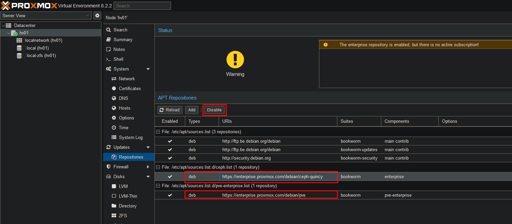
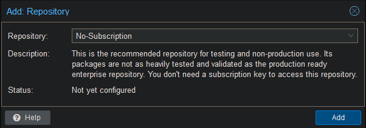
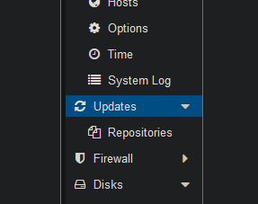
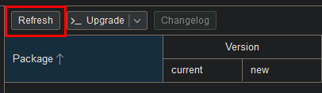
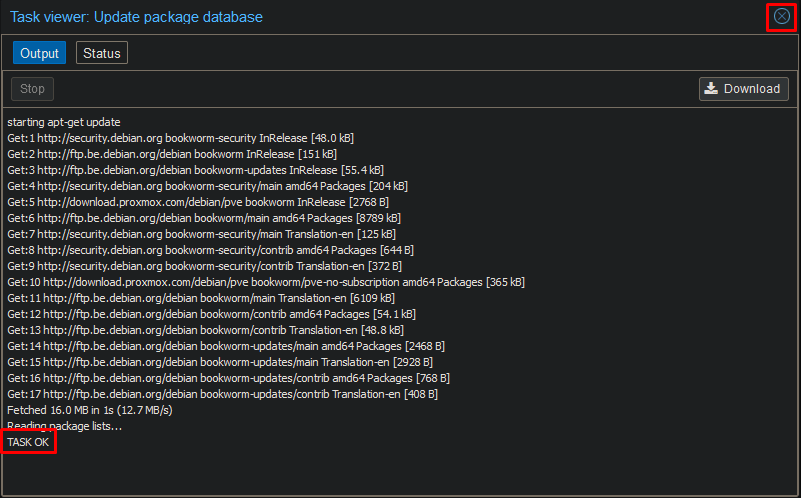
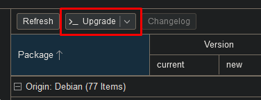
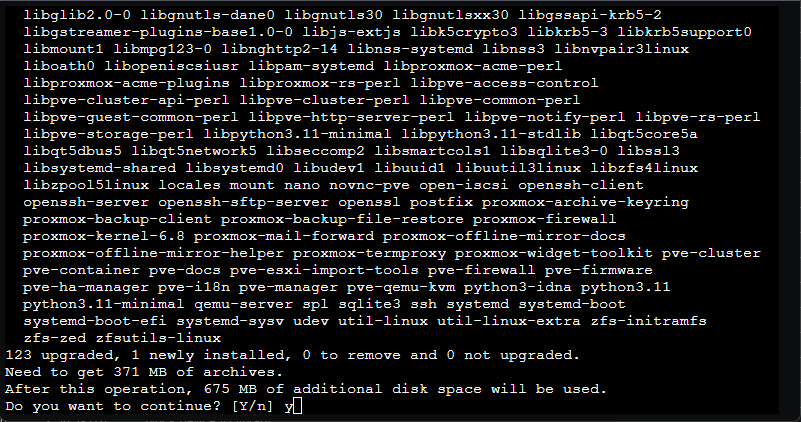
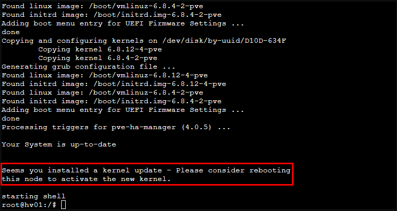
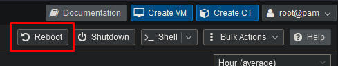

 
After installing proxmox we will have to change some settings.

## Update repository

After installing proxmox the default update repository will be set to the enterprise repository.
As this is a simple homelab we will disable this repository and add the free one.

Select both the enterprise repositories and select disable.

Now select Add, click ok on the subcription warning and add the "No-Subscription" repository

Go to updates

Hit the Refresh tab to search for new updates.

Once the task says OK, you may close the window.

You will now see all the new updates ready to be installed on your server.

Select upgrade.

A new pop will show up. Type "y" in the popup and hit enter.

Wait until the updates have finished.

If you receive a warning about the kernel being updates, you must restart the server.

Select "Reboot" in the top right corner.

