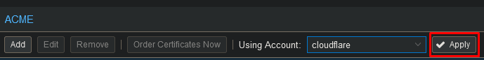

In this example I will automate Let's encrypt certificates using cloudflare API.

Got to your ACME settings and add the cloudflare plugin.

Add the account at the top.

Enter the accountname, your e-mail and accept the TOS.

Now go to your server certificates and set your account.

Now add your domain.

Now select "Order Certificates Now" to start the certificate request. Proxmox will keep this certificate up to date.

Proxmox will now restart with the new certificate.
