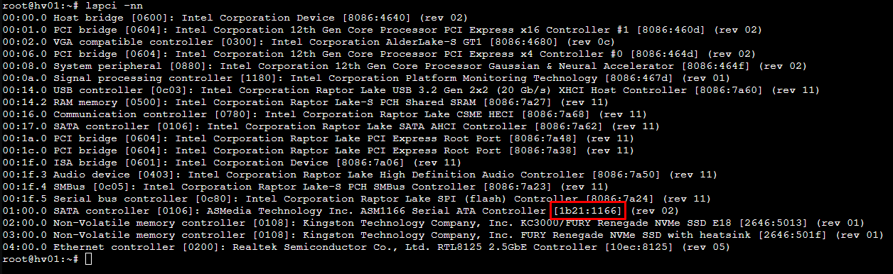
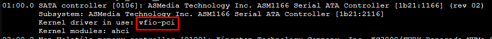

Run the command to check if the SATA controller is in its own IOMMU group:

```
ls -al /sys/block/sd*
```

In case the ID ends in anything other than .0 the IMMOU group is shared. To solved this you need to install the card in the CPU PCI-E slot. Cheap consumer motherboards have all chipset PCI-E slots shared.


Using the following command you can see the main device.

```
#!/bin/bash
for d in $(find /sys/kernel/iommu_groups/ -type l | sort -n -k5 -t/); do 
    n=${d#*/iommu_groups/*}; n=${n%%/*}
    printf 'IOMMU Group %s ' "$n"
    lspci -nns "${d##*/}"
done;
```


After switching the device to the correct PCI-E slot, it now shows correctly.

Now we have to enable IOMMU.

```
nano /etc/kernel/cmdline
```

Add intel_iommu=on at the end of the first line. If you have an AMD cpu, replace intel by AMD.


Save the file by hitting CTRL + X, Y and enter.

Open the modules file and add the following modules to the bottom of the file.

```
nano /etc/modules
```

```
vfio
vfio_iommu_type1
vfio_pci
vfio_virqfd
```

Save the file by hitting CTRL + X, Y and enter.

Run the following commands to apply the settings.

```
proxmox-boot-tool refresh
update-initramfs -u -k all
```

Now restart your system. 

Use the following command to get the ID of the controller.

```
lspci -nn
```



Open the config file.

```
nano /etc/modprobe.d/vfio.conf
```

Add the following to the config file. Make sure to replace the id with the id of your card.

```
softdep ahci pre: vfio_pci
options vfio-pci ids=1b21:1166
```

Save the file by hitting CTRL + X, Y and enter.

Run the following command.

```
update-initramfs -u -k all
```

Restart the system and check if the SATA controller is now using the vfio-pci driver.

```
lspci -nnk
```



When checking your hard drives, you will notice that the drives are missing now.

In order to passthrough your PCI devices, you must create UEFI based VMs.
Memory ballooning must be disabled as well.