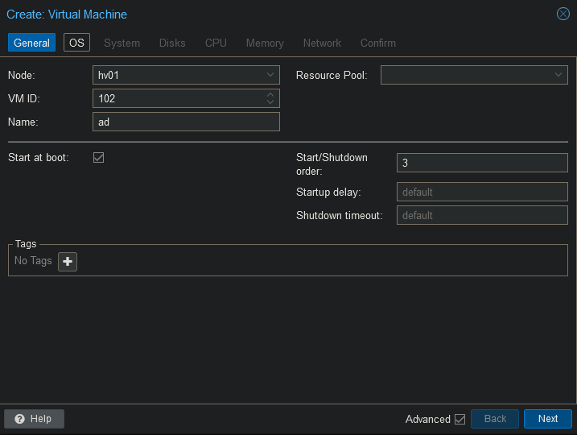
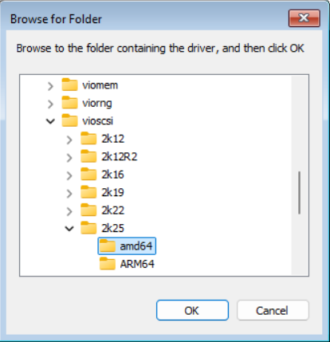

 
## VM Configuration

For Windows 11 leave the CPU type to the default value. Changing it to host will cause the VM to bluescreen.

## Windows Setup

I am leaving the language on English (United States) because I am planning to install Active Directory on it. I prefer to have my AD installed in English.

I am leaving the more obvious screenshots out.

You will notice the system does not find any hard drives. You will have to load the virtio iscsi drivers from the ISO mounted during VM creation.

Once windows is installed open the virtio ISO and install the following 2 files.

