 
### Downloading LXC Template

Go to your storage which has "CT Templates" enabled and click on "Templates".

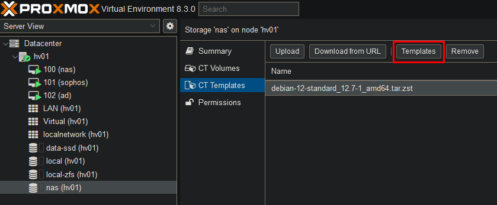

Select the distribution you want to use for your LXC and click on "Download".

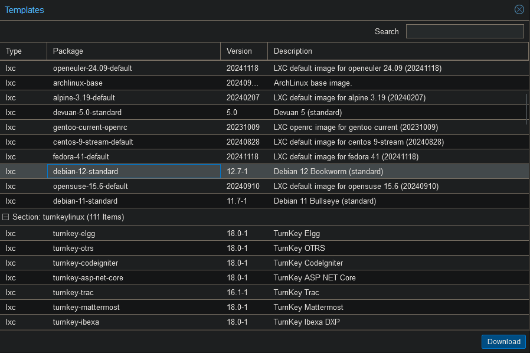

### Create LXC

Click "Create CT" in the top right corner.

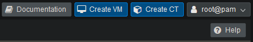

Give your container a hostname and password. Click on "Next".

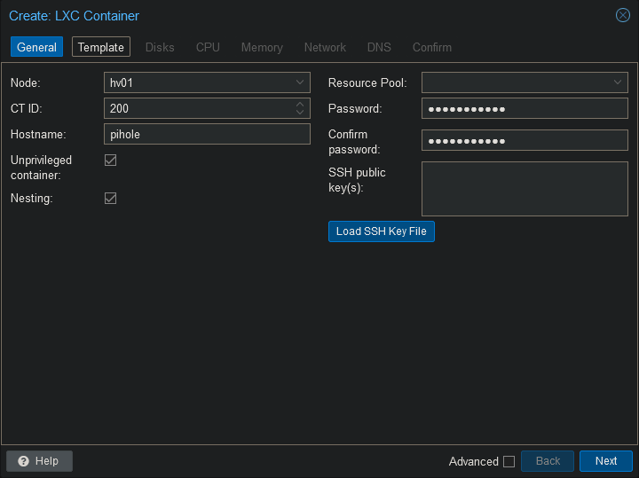

Select the storage and template you wish to use. Click on "Next".

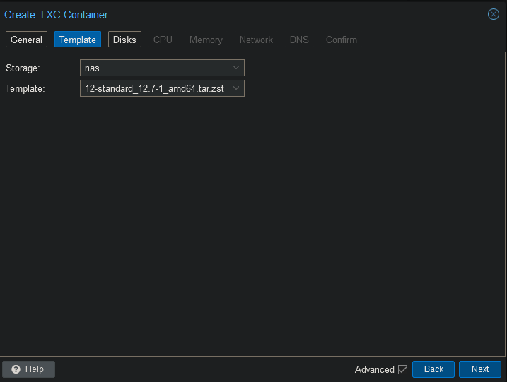

Choose where you want to save the LXC disk and click on "Next".

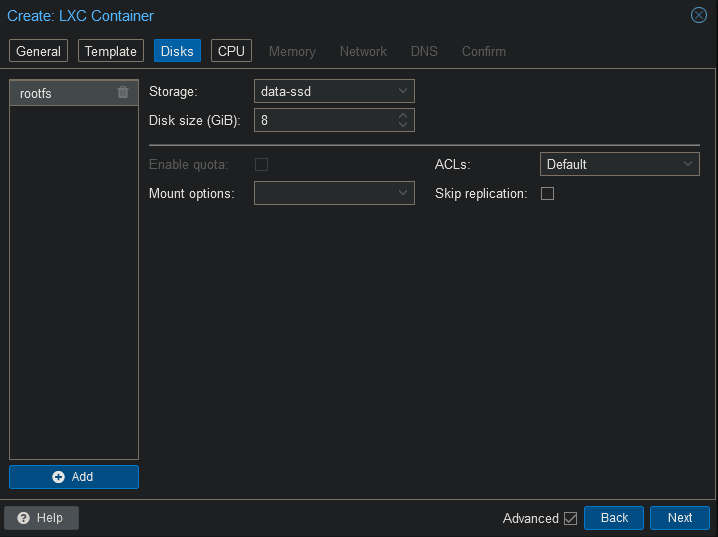

Choose how much CPU power this container may use. Click on "Next".

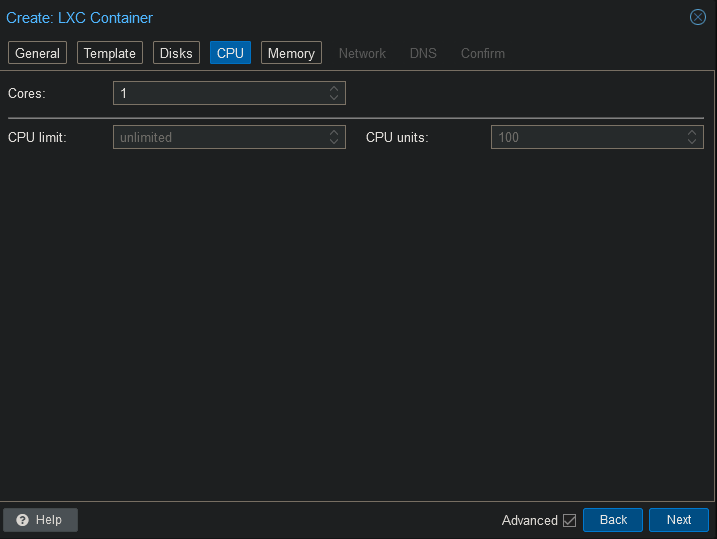

Set how much memory the container may use.

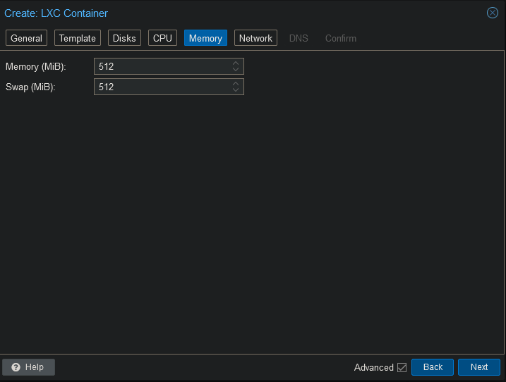

Select the correct network interface and assign an IP address if needed. Click on "Next".

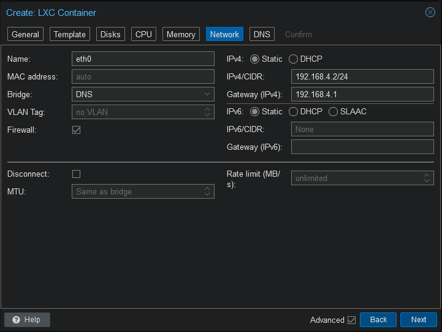

Set the DNS settings and click on "Next".

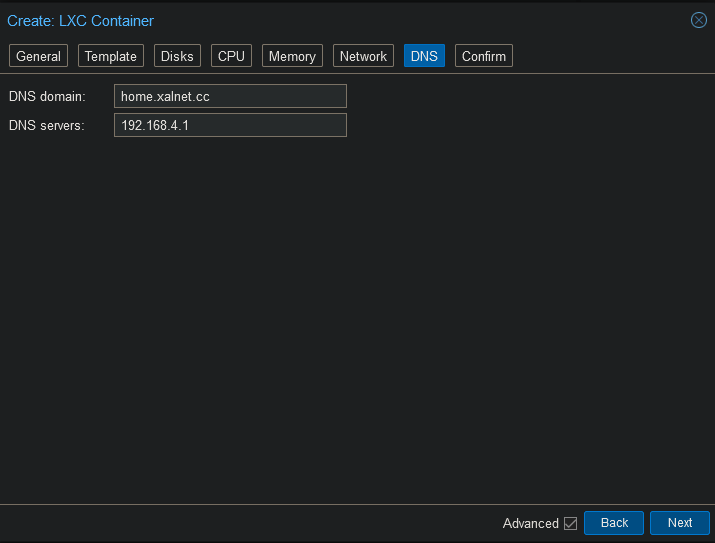

After reviewing the settings you may click on "Finish". In case you want the container to instantly start, select "Start after created".

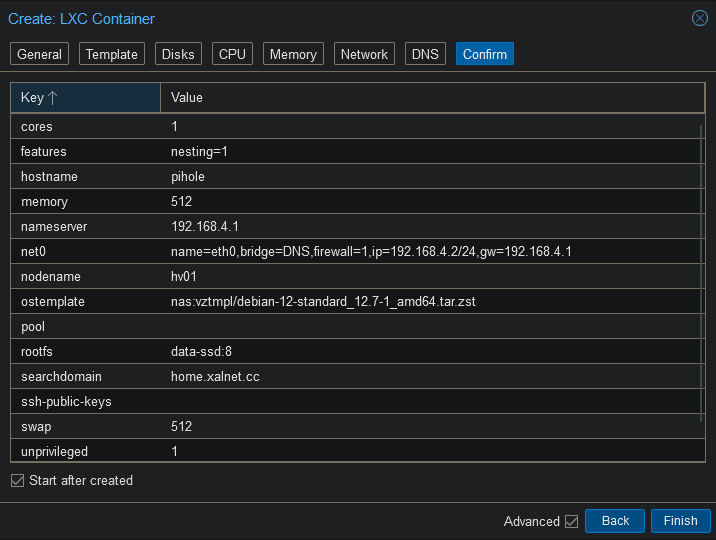

The container will now be created from the template. Once the container has started, you can login with the user "root" and the password you have set during the install.