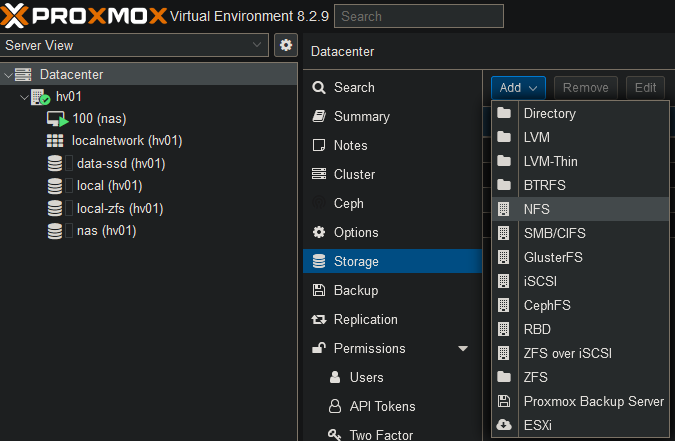
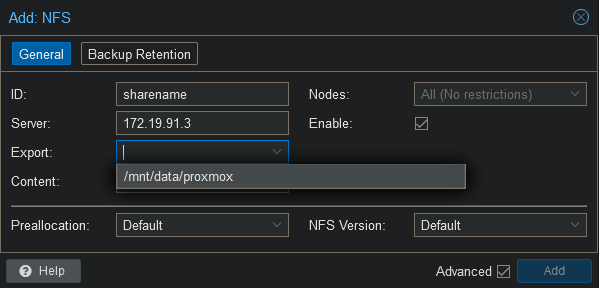
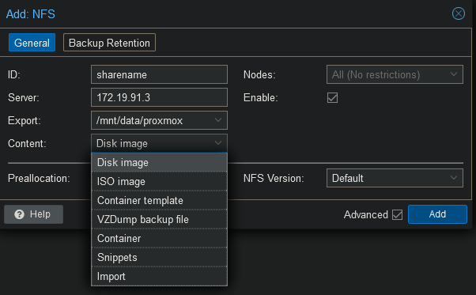

 
In Datacenter Storage add the NFS share.

Set the name for Proxmox as the ID and enter the IP address of the server hosting the NFS share.
If the settings are set up properly the mount points will show.

Select the content types you wish to save to this share.

