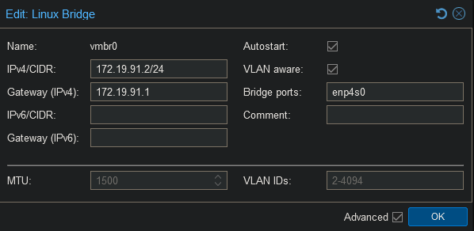
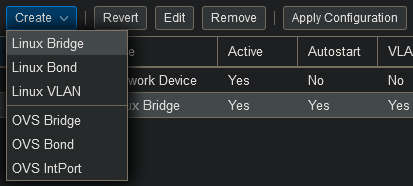
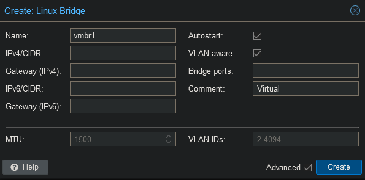
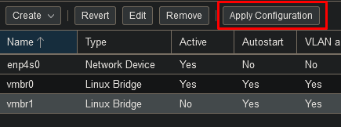

 
Network bridges are basically the Hyper-V Virtual Switch equivalent. 

Make sure VLAN aware is enabled so we can tag vlans on the bridge.
In case you have multiple bridges you can write a comment to distinguish the use of each bridge.

Bridge ports is the physical network adapter used for this bridge.

We will create a separate bridge for our traffic between virtual machines and the virtual firewall as I do not want the traffic to broadcasted on the physical network. For security reasons you should use a second NIC for the firewall, but as this is a simple homelab setup, I will not be investing in a second NIC.

After creating bridges or editing one, do not forget to click on the "Apply Configuration" button.

