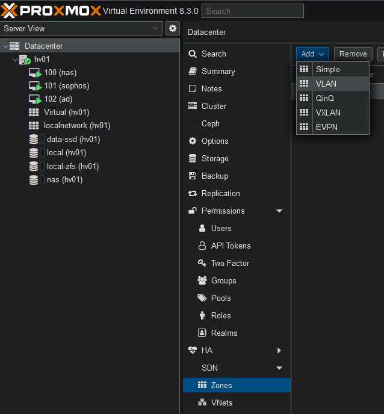
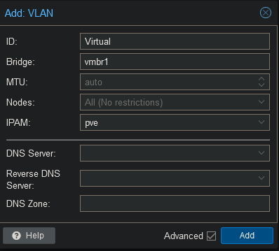
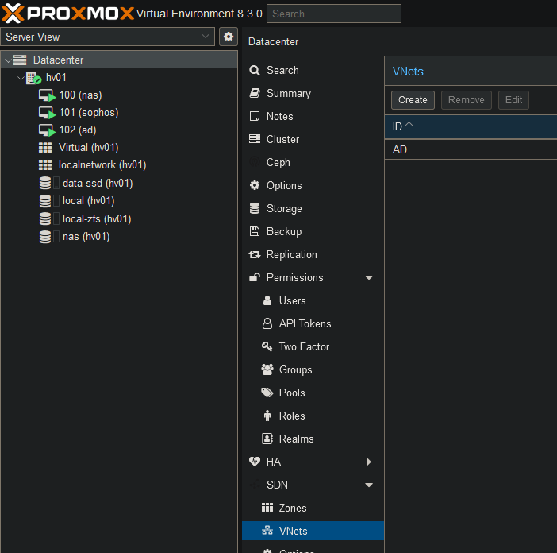
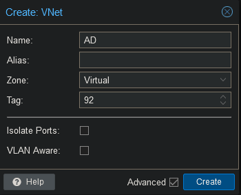
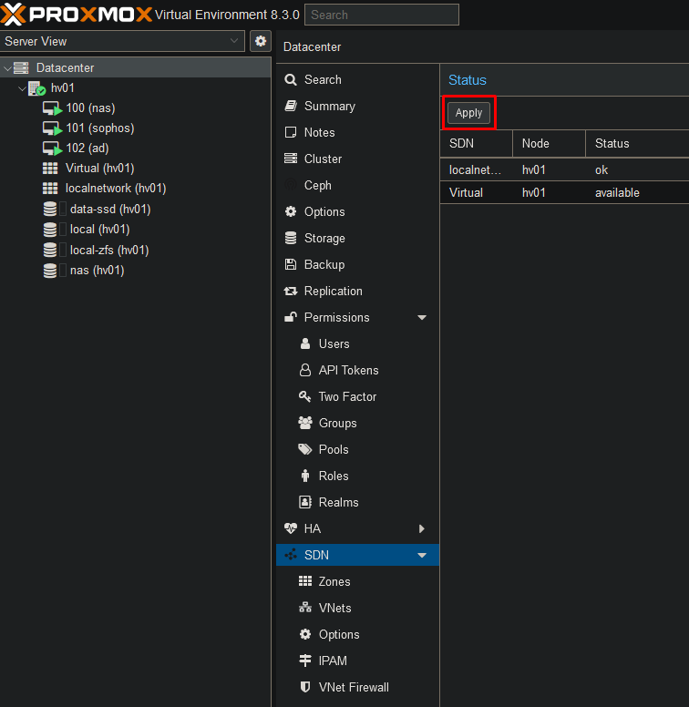
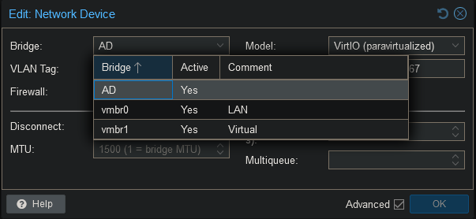

 
The SDN feature allows us to create zones and networks. This will simplify the advanced network configuration in Proxmox.

Create a zone for each of your bridges.

Give the zone a name and type the correct bridge name.

Now go to VNets and click on "Create".

Now select the name for the VNet, the zone and add the correct vlan tag.

To save your settings go back to SDN and click on "Apply".

Once this is saved you can go back to your VM Network Device and select the newly created VNet. Make sure to remove the VLAN Tag as well. As you can see this simplifies configuring VLANs on your VMs.

