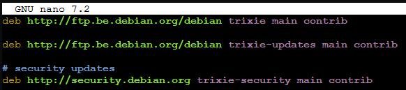
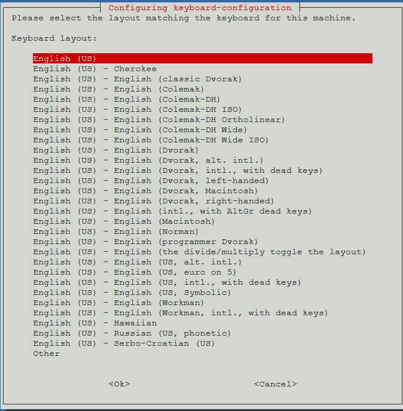
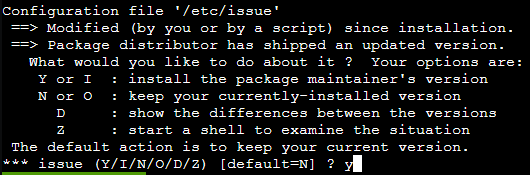
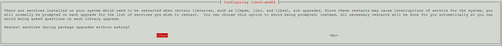
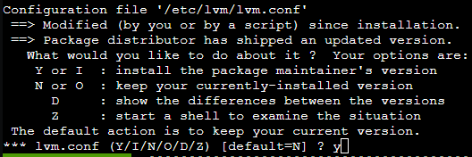

```
sed -i 's/bookworm/trixie/g' /etc/apt/sources.list
sed -i 's/bookworm/trixie/g' /etc/apt/sources.list.d/ceph.list
rm /etc/apt/sources.list.d/pve-enterprise.list
```

```
nano /etc/apt/sources.list
```

Delete the proxmox.com entry



Hit "CTRL + X", y and enter to save the file.

In case you have the enterprise repository run the following command.

```
cat > /etc/apt/sources.list.d/pve-enterprise.sources << EOF
Types: deb
URIs: https://enterprise.proxmox.com/debian/pve
Suites: trixie
Components: pve-enterprise
Signed-By: /usr/share/keyrings/proxmox-archive-keyring.gpg
EOF
```

If you have the no-subscription repository run the following command.

```
cat > /etc/apt/sources.list.d/proxmox.sources << EOF
Types: deb
URIs: http://download.proxmox.com/debian/pve
Suites: trixie
Components: pve-no-subscription
Signed-By: /usr/share/keyrings/proxmox-archive-keyring.gpg
EOF
```

Start the upgrade process.

```
apt update && apt dist-upgrade -y
```

Select your keyboard layout.



Select "y" to replace the /etc/issue file.



Select Yes to restart all services automatically.



Select "y" to replace the /etc/lvm/lvm.conf file.



```
reboot
```

