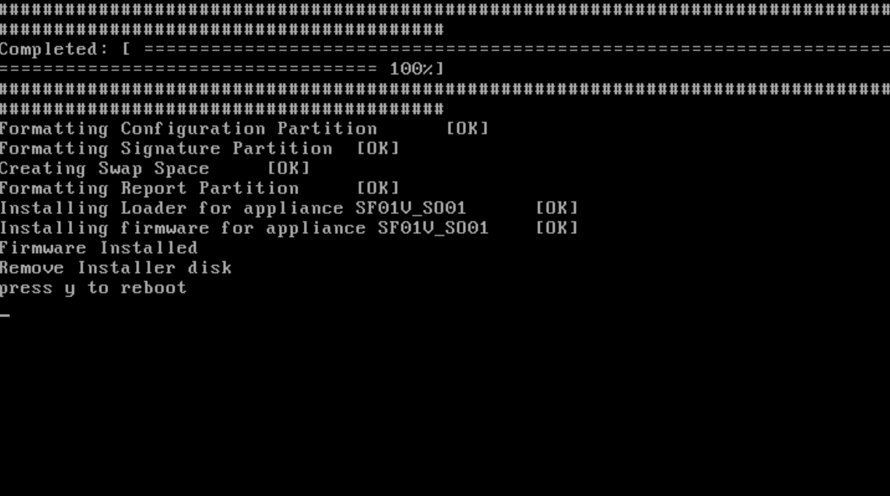

 
## Download

Go to https://www.sophos.com/en-us/free-tools/sophos-xg-firewall-home-edition/software and download the free version of Sophos. Once you have signed up you will receive an e-mail with a serial number for your free firewall.

## Create VM

The VM can only have up to 4 cores and 6GB of memory. These are the limitations of the free home edition.

You will need 1 network adapter per interface / vlan. You will not be able to perform VLAN tagging inside of the VM. As a default you will need 2 network adapters to be able to install Sophos. The first network adapter will be interface LAN and the second network adapter will be interface WAN.

## Install OS

Start up the VM to initialize the setup.

Type "y" and hit enter to start the setup.

Remove the ISO from the dvd drive and type "y" to reboot.

