## Initializing and registering the firewall

Go to the default web page https://172.16.16.16:4444

Accept the terms of use.

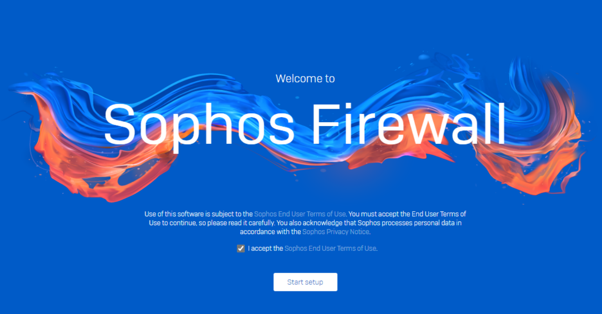

Enter your new password for the "admin" user.

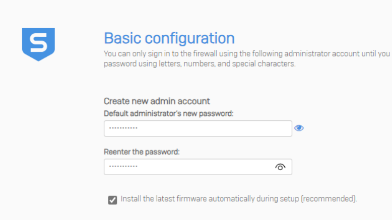

Enter a secure storage master key. Make sure to document this key properly.

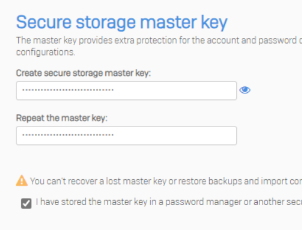

Set the FQDN for the firewall and timezone.

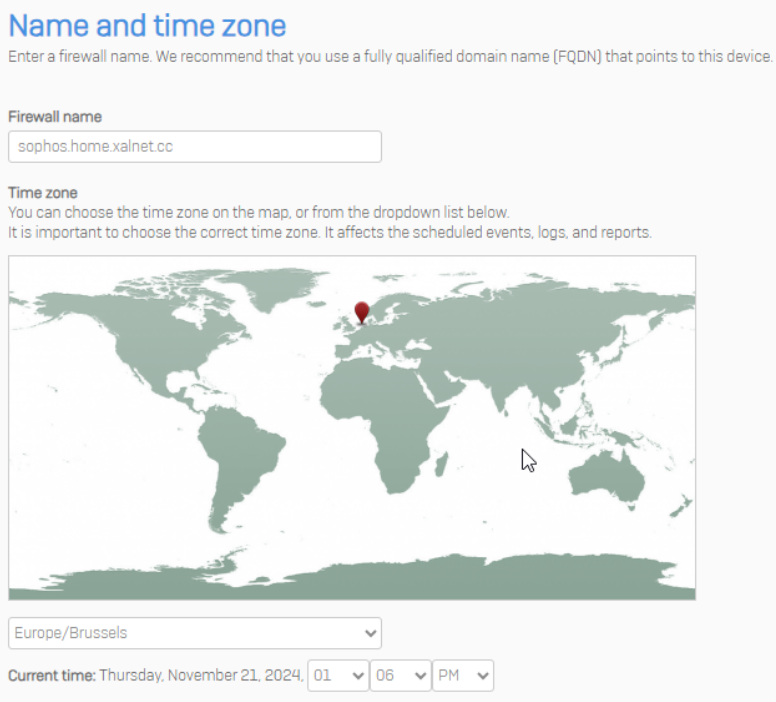

Enter the serial number you have received from sophos over email.

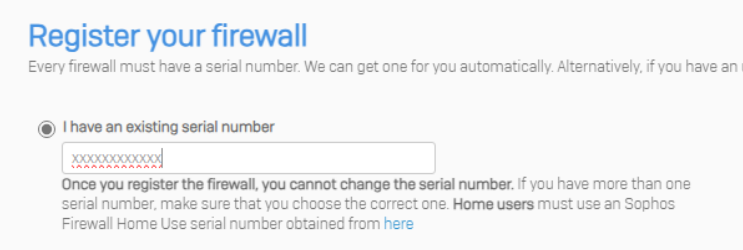

Opt out of the customer experience improvement program and skip to finish.

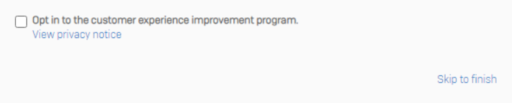

The firewall will now apply the basic configuration and restart.

Once you login you will be greeted by a popup about Sophos Central.
Click on "Get Started" to register your firewall in Sophos Central.

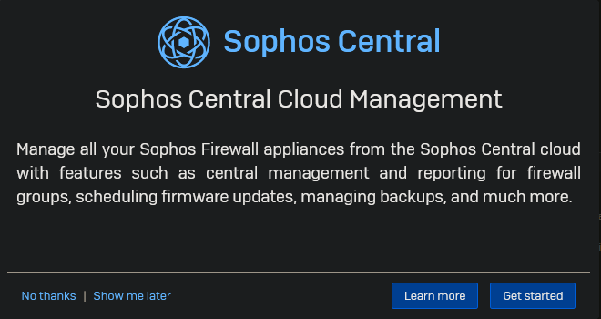

Click on "Register".

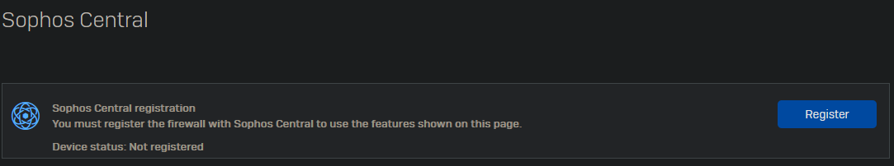

If you do not have a Sophos Central account yet, you can create one. Otherwise you may log in.
Do note that this registration for home use differs from enterprise use.

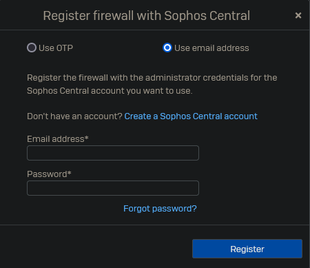

Enable the Sophos Central Services.

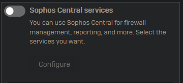

Log into Sophos Central and accept the firewall.

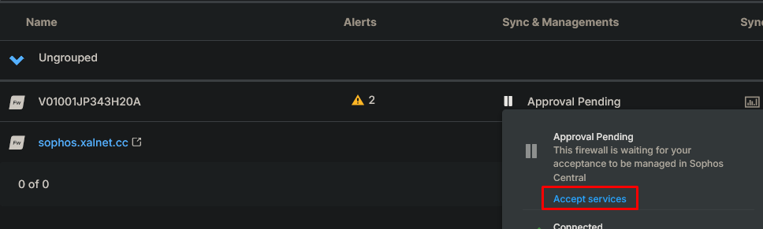

## Basic Configuration

We will now go through the basic settings you should perform after initializing a new firewall.

### Default CA

Go to Certificates -> Certificate authorities and edit the default CA.

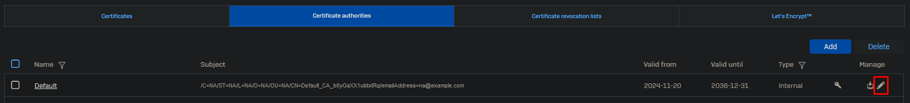

Fill in the details and make sure to document the private key. 

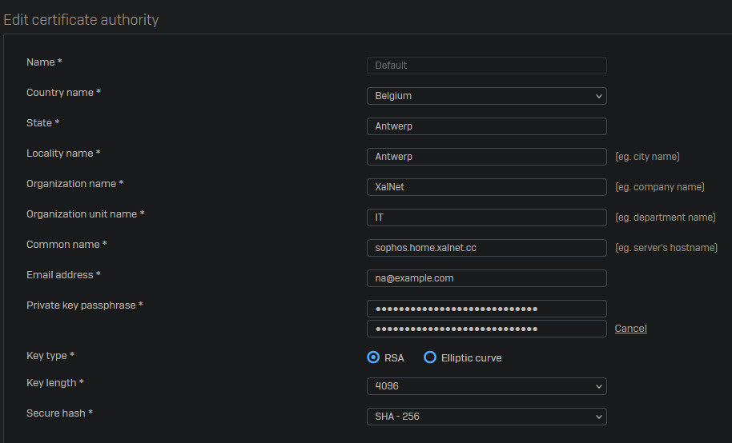

Now go the the "Certificates" tab and regenerate the "ApplianceCertificate".

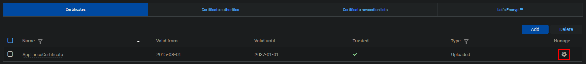

### Firewall Rules

Delete all the default firewall rules and create a temporary allow all and drop all firewall rule.

Go to Rules and policies -> Firewall rules.

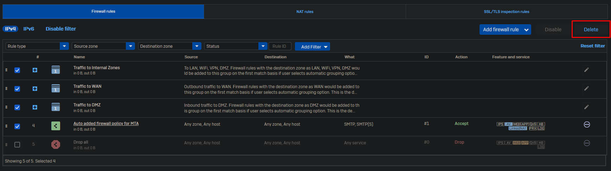

Now select Add firewall rule -> New firewall rule.

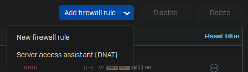

As this is a temp allow all rule we will keep it simple with no scanning and only logging as no other features have been configured yet.

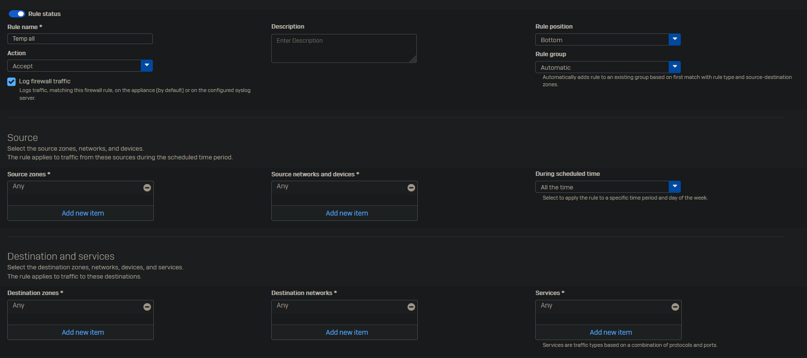