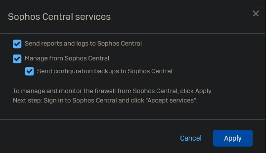
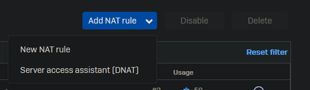
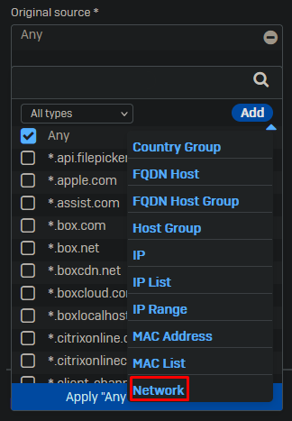

## Initializing and registering the firewall

Go to the default web page https://172.16.16.16:4444

Accept the terms of use.

Enter your new password for the "admin" user.

Enter a secure storage master key. Make sure to document this key properly.

Set the FQDN for the firewall and timezone.

Enter the serial number you have received from sophos over email.

Opt out of the customer experience improvement program and skip to finish.

The firewall will now apply the basic configuration and restart.

Once you login you will be greeted by a popup about Sophos Central.
Click on "Get Started" to register your firewall in Sophos Central.

Click on "Register".

If you do not have a Sophos Central account yet, you can create one. Otherwise you may log in.
Do note that this registration for home use differs from enterprise use.

Enable the Sophos Central Services.

Log into Sophos Central and accept the firewall.

## Basic Configuration

We will now go through the basic settings you should perform after initializing a new firewall.

### Default CA

Go to Certificates -> Certificate authorities and edit the default CA.

Fill in the details and make sure to document the private key. 

Now go the the "Certificates" tab and regenerate the "ApplianceCertificate".

### Firewall Rules

Delete all the default firewall rules and create a temporary allow all and drop all firewall rule.

Go to Rules and policies -> Firewall rules.

Now select Add firewall rule -> New firewall rule.

As this is a temp allow all rule we will keep it simple with no scanning and only logging as no other features have been configured yet.

Even though the drop all rule exists, it does not log any dropped traffic. So we will create a new drop all rule with logging enabled.

### NAT rules

Per default the firewall will NAT all traffic between networks. As we do not want to NAT traffic between private networks, we will create a new NAT rule.

Go to Rules and policies -> NAT rules.

Select Add NAT rule -> New NAT rule.

Under source we will add a new source.

You will add 3 networks using the following template below.

10.0.0.0/8
172.16.0.0/12
192.168.0.0/16

Once these are created you can reuse them for the original destination. Leave all other settings on default. Make sure the rule position is set to "Top".

### IPS

Go to Intrusion prevention -> IPS policies and enable IPS Protection.

### Wireless

Sophos comes with a bunch of wireless settings by default that we do not not need.

Go to Wireless -> Wireless networks and delete all wireless networks.

Go to Wireless -> Access point groups and delete the default group.

Go to Wireless -> Hotspot voucher definitions and delete the vouchers.

Go to Wireless -> Wireless settings and disable wireless protection. Do not forget to click apply in the bottom left.

### Email

Change the default hostname for the SMTP feature in Sophos. Not doing so will make your IP end up on a blacklist if you decide to use any of the emailing features within Sophos. Make sure the FQDN provided resolves to a public IP.

Go to Email -> General settings. Change the hostname and click apply on the bottom left of the page below "POP and IMAP TLS configuration"

### Logging

Enable all logging locally and in Sophos Central.

Go to System services -> Log settings.

### Default ports

Go to Administration -> Admin and user settings.

Change the default "User portal HTTPS port" to 4445 and the "VPN portal HTTPS port" to 4443.

### Time

Go to Administration -> Time and select "Use pre-defined NTP Server".
Click on Apply at the bottom left of the page.

### Pattern updates

Go to Backup & firmware -> Pattern updates and change the interval from 2 hours to 15 minutes.

