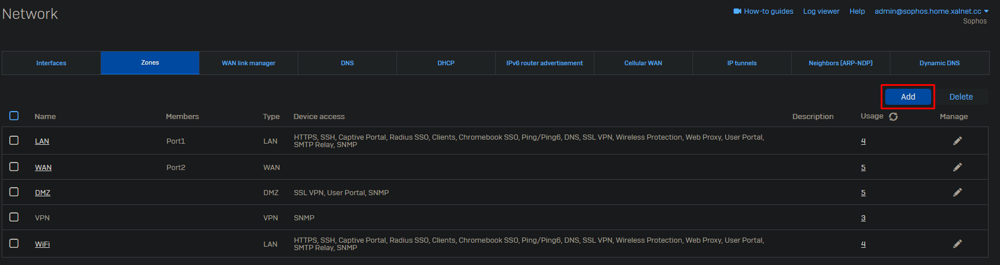
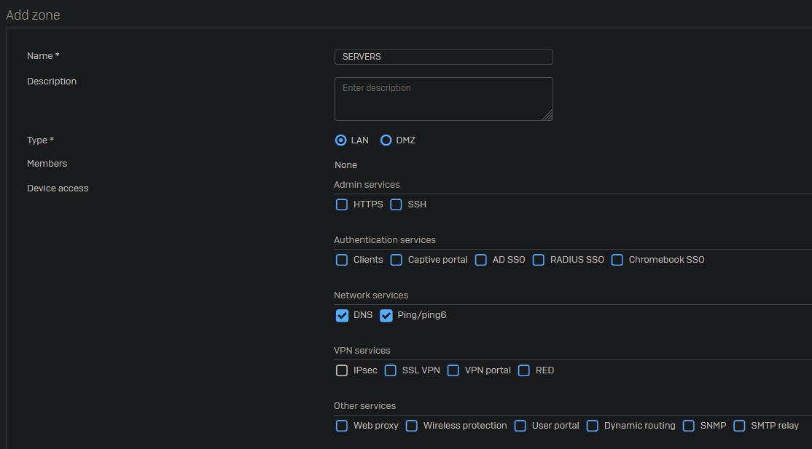

Zones are basically security groups for your network interfaces. Because firewall rules are being made with zones, adding new networks and interfaces to existing firewall rules is easy. All you have to do is assign the correct zone to the interface and all existing firewall rules for this zone will apply for this new network. Zones also make firewall rules interface independent, which is great for migrating to a new appliance.

Got to Network -> Zones and click on "Add".

Give the zone a proper name and select the firewall services which should be available to this zone. In case the zone is going to be used for DMZ purposes, change the type from LAN to DMZ.

Example of zones we create at work:

- AD
- CAMERA
- EXTERNAL
- GUEST
- IOT
- MANAGEMENT
- SECURITY
- SERVERS
- USERS