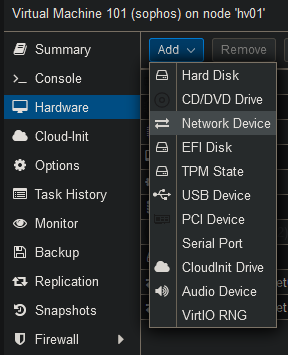
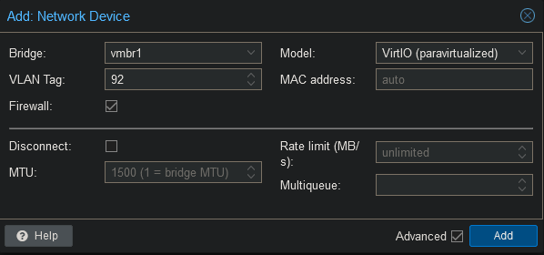
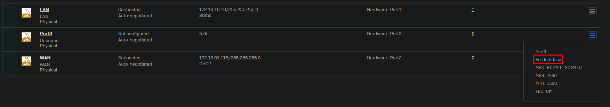
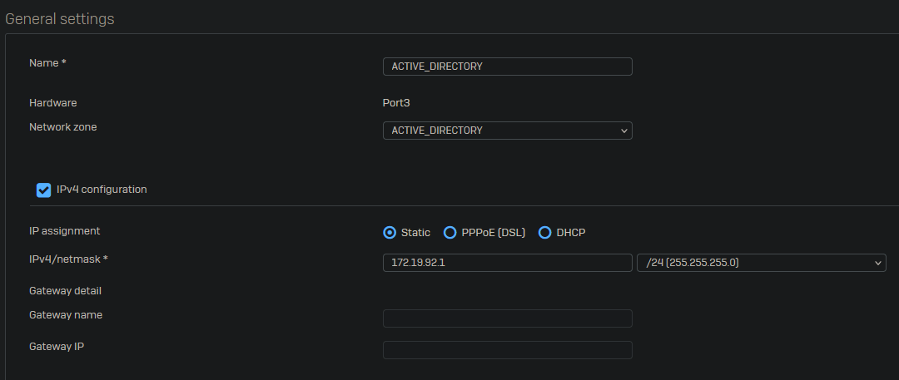

 
Due to Sophos XGS being virtualized we cannot use the VLAN interface feature. All hypervisors will block VLAN tagging by default from a virtual machine. Because of this we will have to create all interfaces on proxmox by adding a network adapter per VLAN.

Go to the "Hardware" tab and select Add -> Network Device.

Select the correct network bridge and add the VLAN tag.

After adding the interfaces the firewall must be restarted in order to detect them. The interfaces will show up in the same order as they are configured Proxmox. Network adapter 3 Proxmox will be Port 3 in Sophos.

Once the server has been restarted, you will see the new network interface. Click on "Edit Interface" to change the settings.

Change the network zone, after this you will be able to change the name. Assign an IPv4 address and click on save on the bottom left of the page.

