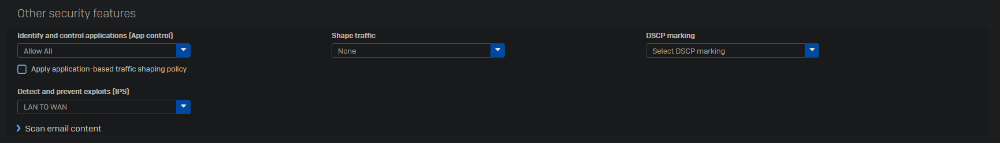

 
In this example we will create an HTTP(S) firewall rule with the filter we created during the Web Policies setup.

Go to Rules and policies -> Firewall  rules and click on "Add firewall rule -> New firewall rule".

Give the rule a proper name and enable logging.

I like to put my firewalls in group based on destination. This gives a better overview of your firewall rules once you have fully configured your ruleset.

Click on "Rule group -> Add".

Give the group a proper name and select the destination zone.

Select the source and destination zones. I leave the source and destination networks on "Any" as this rule applies to all devices from these zones. For services select "HTTP" and "HTTPS".

In an enterprise environment you'd want to a separate rule for your AD and Management as these networks are supposed to be offline. As this is my basic install of the network I will allow them to go to the internet. In the future once everything is set up properly I will create more advanced rules.

Select the newly created "Home" policy we made earlier and enable the following options.

Set the app control to "Allow All" for monitoring purposes only. In enterprise environment you'd want to start off with "Block very high risk".  The "Block high risk" will also block WhatsApp. You can click the pencil icon next to the filter to see which apps would be blocked by each level.

Set IPS to "LAN TO WAN" as this traffic is going from our internal network to the internet.

Click "Save".

As you can see the new firewall rule is placed inside of a group. New rules to the WAN zone will automatically be grouped in the same group. For other destinations you will have to create a new group first.

Try to order your firewalls rules from top to bottom, by the most used firewall rules at the top. Try to separate as much traffic as you can over multiple rules as this allows for better control and security.