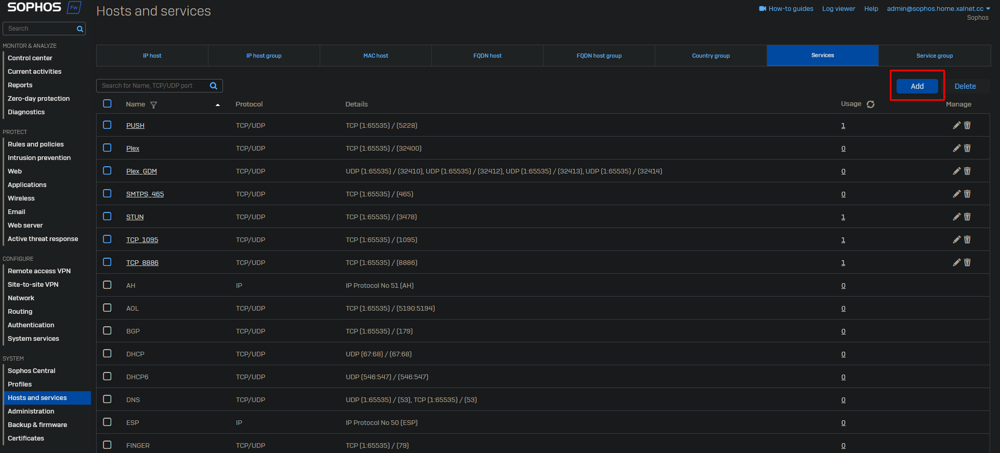
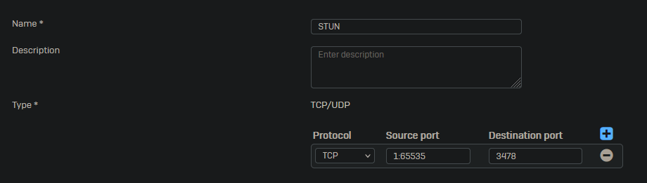
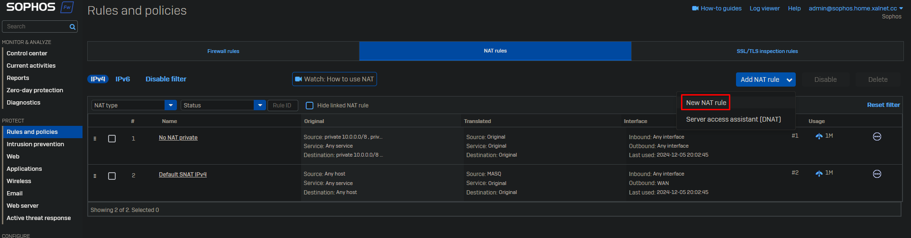
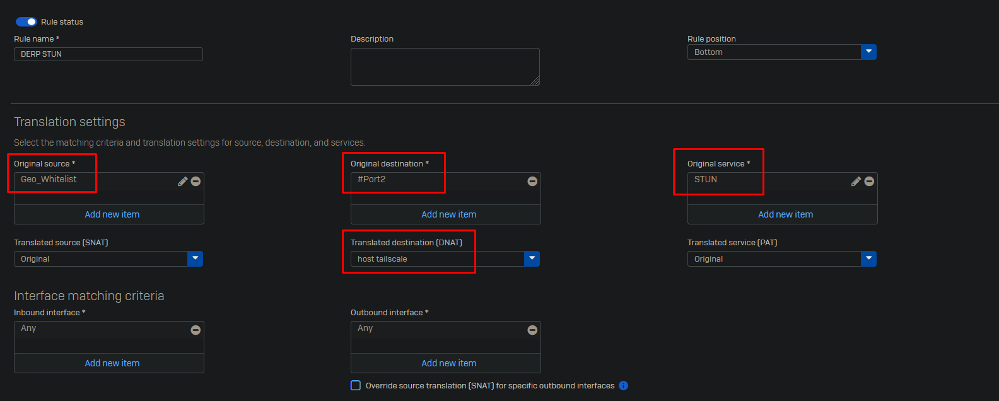
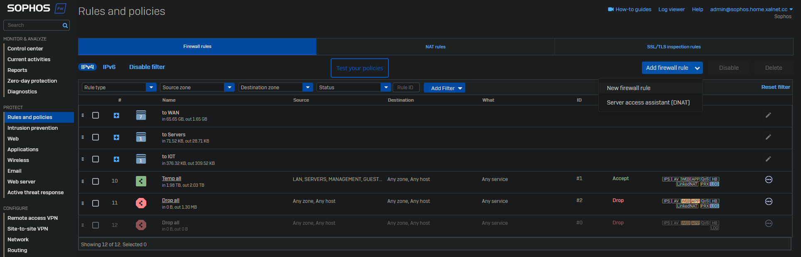
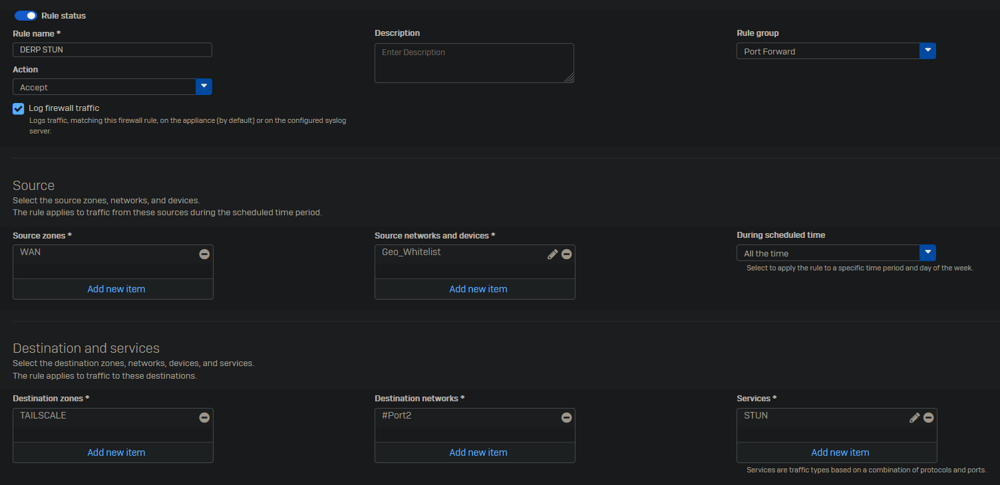
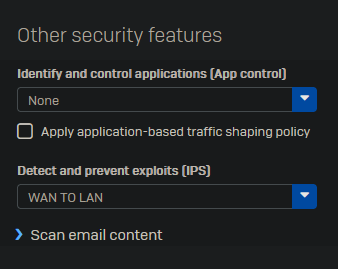

 
In this example I will port forward the STUN port for my custom tailscale derp server.

Go to Host and services -> Services and click on "Add".

Give the service the proper name and add the required ports.

Click on "Save" at the bottom.

Go to Rules and policies -> NAT rules and click on Add NAT rule -> New NAT rule.

Give the rule a name. Select the source which is allowed to connect to the port. I have created a Geo_Whitelist country group and added the countries which are allowed to connect to this port. As destination select the interface that has to listen the requests. Set the DNAT to the required host. Finally select the service you wish to forward.

Click "Save" at the bottom.

Now go to Rules and Policies -> Firewall rules and click on "Add firewall rule -> New firewall rule".

Give the rule a name. Enable "Log firewall traffic". Select the correct source, destination and service.

At "Other security features" select the "WAN TO LAN" IPS rule.

Click on "Save" at the bottom of the page.