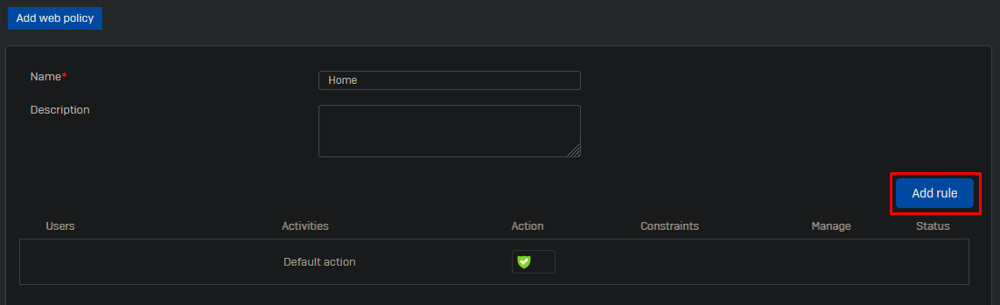
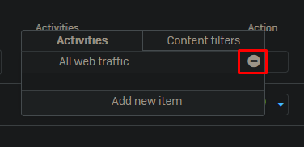
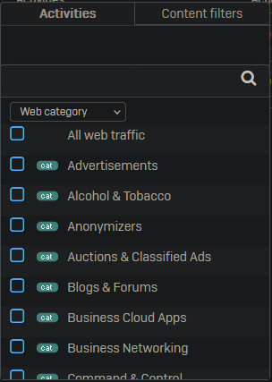
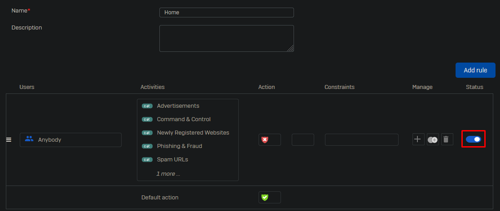

 
To protect your https traffic we can apply a web policy. These are just filters.

Go to Web -> Policies and click on "Add policy" at the top right.

Give the policy a name and click on "Add rule".

Click on "All web traffic" and delete this rule.

Now click on "Add new item" and change the dropdown category to "Web category".

Select the following categories:

- Advertisements
- Command & Control
- Newly Registered Websites
- Phishing & Fraud
- SPAM URLs
- Spyware & Malware

In an enterprise environment you might want to add more categories.

Enable the rule.

Leave all other options default and click on "Save" at the bottom of the page.