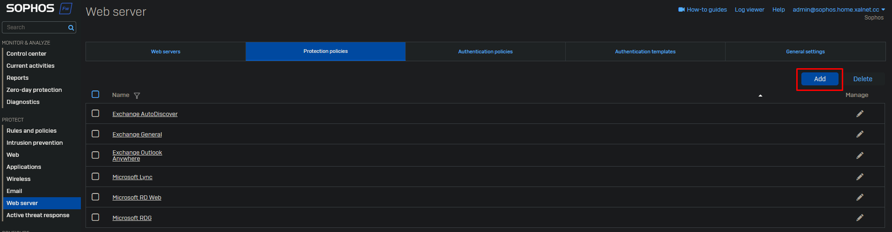
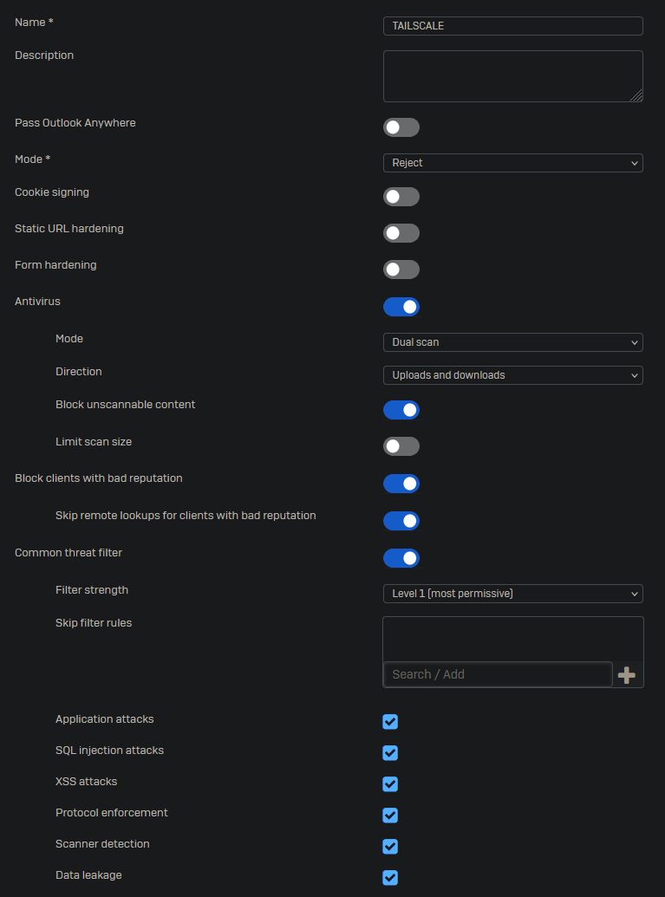
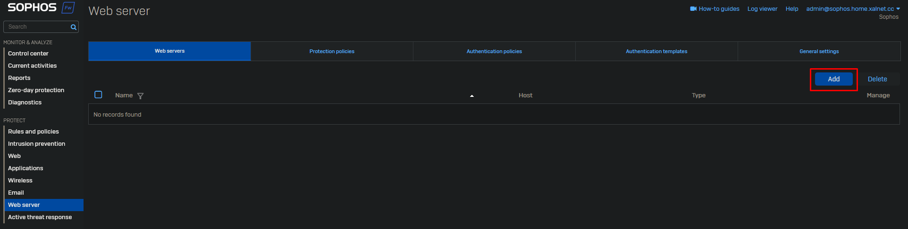
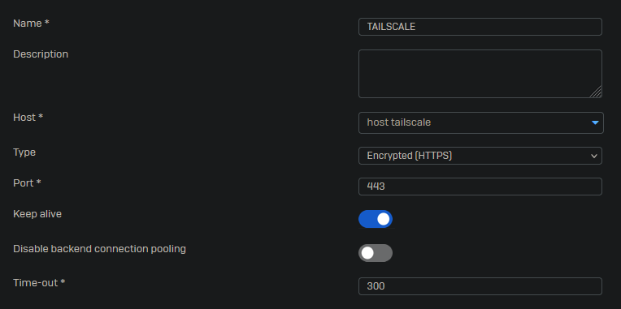
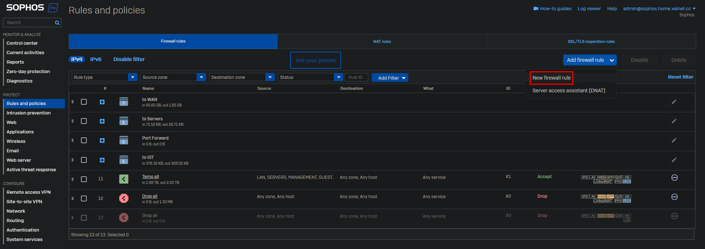
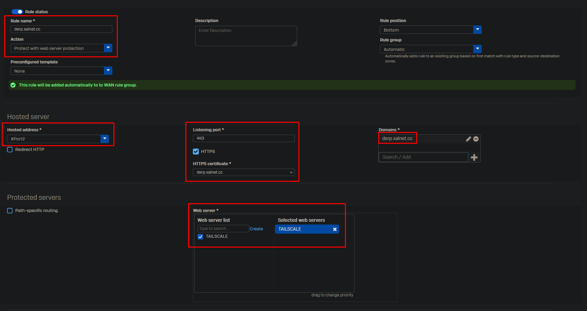
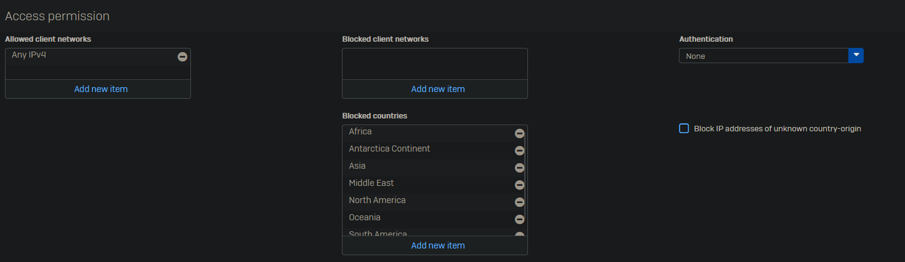

 
Go to Web server -> Protection Policies and click on "Add".

Create a new policy and select the security features you wish to use. It's best to create a separate policy for each web server as some features may break things on your webservice.

Click on "Save" at the bottom of the page.

Go to Web Servers and Click on "Add".

Fill in the details of your web server.

Click on "Save" at the bottom of the page.

Go to Rules and policies -> Firewall rules and click on Add firewall rule -> New firewall rule.

Give your rule a name and select "Protect with web server protection". As hosted address select the interface which is listening to the web request. Enable HTTPS and select your certificate, the domain will be automatically filled from the certificate. In case you use a wildcard certificate you may need to change this. Select your web server you wish to protect.

As for now there is no option to whitelist option you can opt to blacklist countries.

Select your protection policy and the "WAN TO LAN" IPS policy.

Click on "Save" at the bottom of the page.