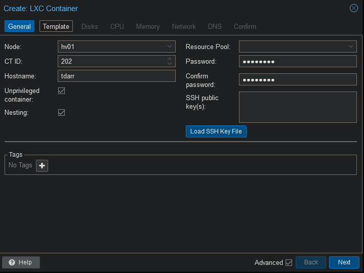
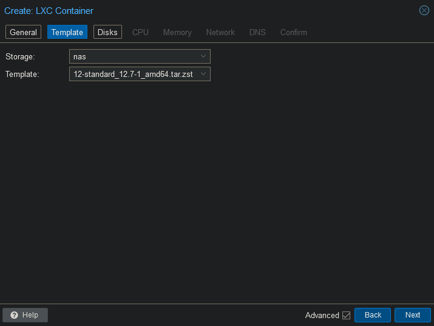
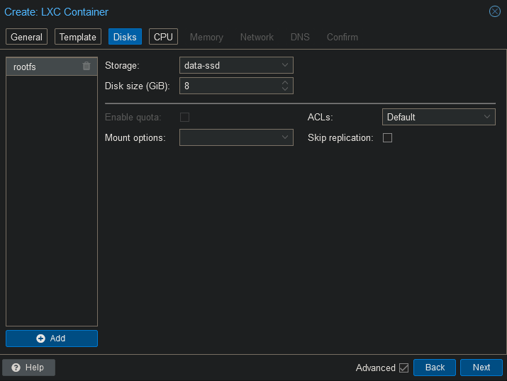
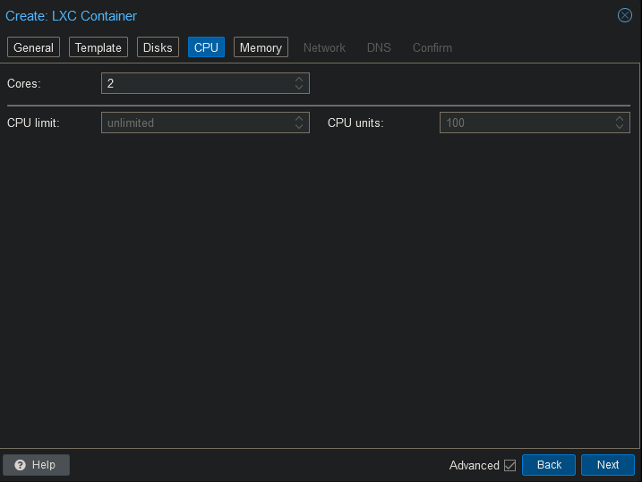
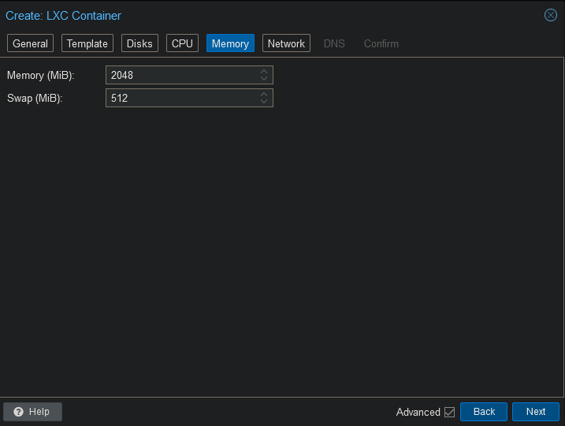
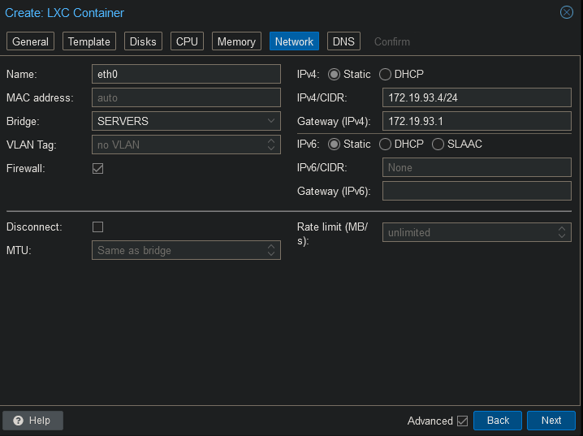
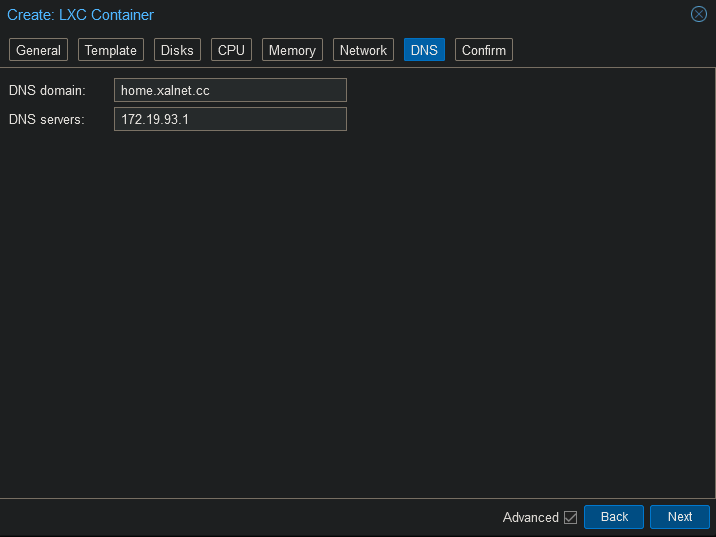

###  LXC Configuration















### Add mountpoint

Open the shell on the Proxmox host and run the following command. Change the id to whatever id your container has.

```
pct set 202 -mp0 /mnt/pve/nas/video,mp=/mnt/video
pct set 202 -mp1 /mnt/pve/nas/cache/tdarr,mp=/mnt/cache
```

### Add iGPU

Open the shell on Proxmox and run the following command.

```
nano /etc/pve/lxc/202.conf
```

Add the following to the end of the file and save.

```
dev0: /dev/dri/card0,gid=44,uid=0
dev1: /dev/dri/renderD128,gid=104,uid=0
```
### Install Tdarr

Connect to the container’s shell.

```
apt update
apt upgrade -y
```

Install the dependencies.

```
apt install curl sudo mc handbrake-cli -y
```

Install the following drivers.

```
apt install va-driver-all ocl-icd-libopencl1 intel-opencl-icd vainfo intel-gpu-tools -y
```

Install Tdarr using the following code.

```
mkdir -p /opt/tdarr
cd /opt/tdarr
RELEASE=$(curl -s https://f000.backblazeb2.com/file/tdarrs/versions.json | grep -oP '(?<="Tdarr_Updater": ")[^"]+' | grep linux_x64 | head -n 1)
wget -q $RELEASE
unzip Tdarr_Updater.zip
rm -rf Tdarr_Updater.zip
chmod +x Tdarr_Updater
./Tdarr_Updater
```

Create the needed services.

```
service_path="/etc/systemd/system/tdarr-server.service"
echo "[Unit]
Description=Tdarr Server Daemon
After=network.target
# Enable if using ZFS, edit and enable if other FS mounting is required to access directory
#Requires=zfs-mount.service

[Service]
User=root
Group=root

Type=simple
WorkingDirectory=/opt/tdarr/Tdarr_Server
ExecStartPre=/opt/tdarr/Tdarr_Updater                  
ExecStart=/opt/tdarr/Tdarr_Server/Tdarr_Server
TimeoutStopSec=20
KillMode=process
Restart=on-failure

[Install]
WantedBy=multi-user.target" >$service_path
```

```
service_path="/etc/systemd/system/tdarr-node.service"
echo "[Unit]
Description=Tdarr Node Daemon
After=network.target
Requires=tdarr-server.service

[Service]
User=root
Group=root

Type=simple
WorkingDirectory=/opt/tdarr/Tdarr_Node
ExecStart=/opt/tdarr/Tdarr_Node/Tdarr_Node
TimeoutStopSec=20
KillMode=process
Restart=on-failure

[Install]
WantedBy=multi-user.target" >$service_path
```

Add a resource we need to replace a module in Tdarr and install the module.

```
echo "deb http://www.deb-multimedia.org bookworm main" | tee -a /etc/apt/sources.list
apt update -oAcquire::AllowInsecureRepositories=true
apt install deb-multimedia-keyring -y
apt install ccextractor -y
wget -q https://github.com/jellyfin/jellyfin-ffmpeg/releases/download/v7.0.2-7/jellyfin-ffmpeg7_7.0.2-7-bookworm_amd64.deb
dpkg -i jellyfin-ffmpeg7_7.0.2-7-bookworm_amd64.deb
apt install -f ./jellyfin-ffmpeg7_7.0.2-7-bookworm_amd64.deb
rm jellyfin-ffmpeg7_7.0.2-7-bookworm_amd64.deb
```

Run Tdarr to generate the config files. Once it is done loading, interrupt the Tdarr by pressing "CTRL + C".

```
/opt/tdarr/Tdarr_Server/Tdarr_Server
```

Configure Tdarr to use this module instead of the built in one.

```
nano /opt/tdarr/configs/Tdarr_Server_Config.json
```

Change the following lines:

`"ffmpegPath": "/usr/lib/jellyfin-ffmpeg/ffmpeg",`
`"ccextractorPath": "/usr/bin/ccextractor",`

Do the same in the node config.

```
nano /opt/tdarr/configs/Tdarr_Node_Config.json
```

`"ffmpegPath": "/usr/lib/jellyfin-ffmpeg/ffmpeg",`

Enable the services.

```
systemctl enable --now tdarr-server.service
systemctl enable --now tdarr-node.service
```

Add root to the render group.

```
usermod -aG render root
```

