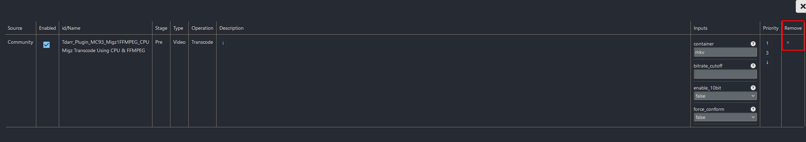

Click on your default node that has been created and add a GPU worker.

Scroll down a little and enable "Auto accept successful transcodes".

At the top go to "Libraries" and click on "Library +".

Enter a name for the library.

Select "Source" and enter the mountpoint.

Select "Transcoding Cache" and enter the cache directory.

Select "Transcode Options" and delete these 2 plugins by clicking on them followed by the purple x.

In the top right corner select "Community" and search for "qsv". Drag the highlighted plugin into the flow at the same position.

