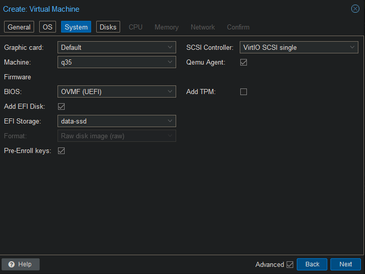
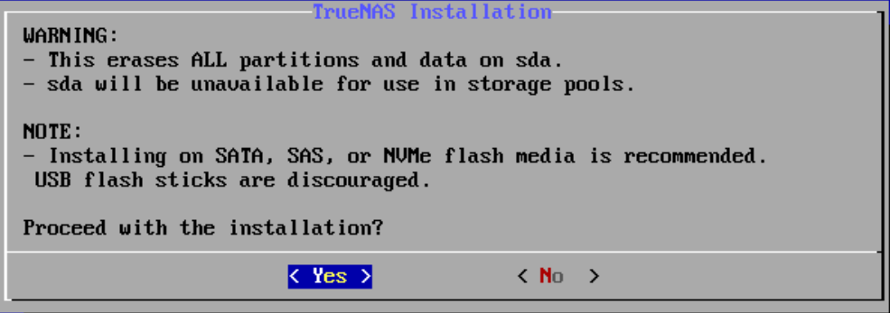

 
## Download ISO

Download the TrueNAS SCALE iso to your repository.

```
https://www.truenas.com/download-truenas-scale/
```

## Create VM





## Setup

Start up the VM and hit F2 to enter the BIOS.
Go to Device Manager -> Secure Boot Configuration
Disable "Attempt Secure Boot".
Save your settings are restart. You should now be able to boot from the ISO.

Select the default option "Start TrueNAS SCALE Installation"

Select "1. Install/Upgrade".


Use the spacebar to select the OS drive and hit enter.


Hit enter to proceed with the installation.



Select "1. Administrative user".


Enter your password.


After hitting enter the installation will start.


Remove the ISO from the DVD drive and reboot the VM.

Browse to the IP address in the console to log onto the web interface.
The username is "truenas_admin" with the password you've provided during the setup.