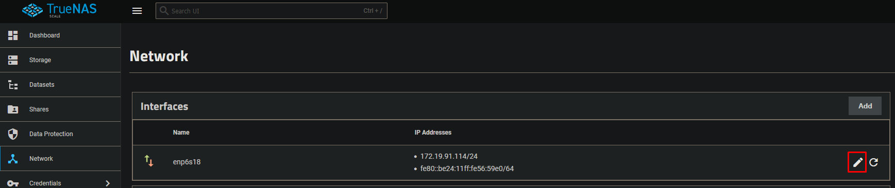
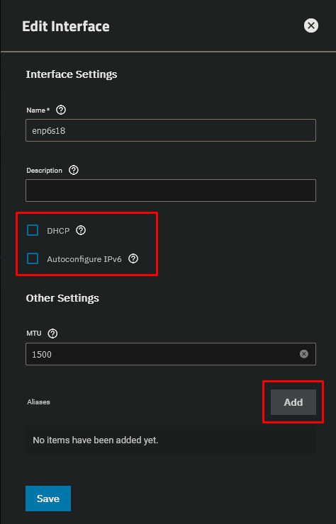
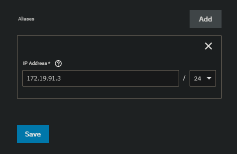
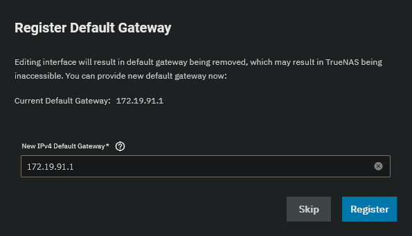
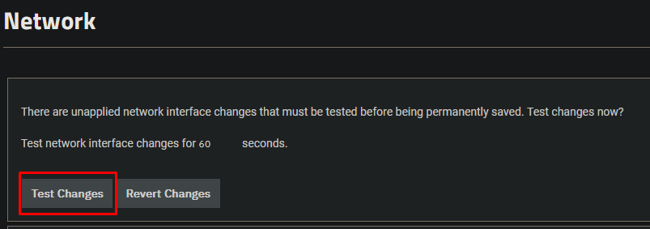
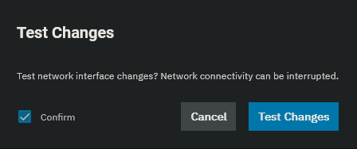
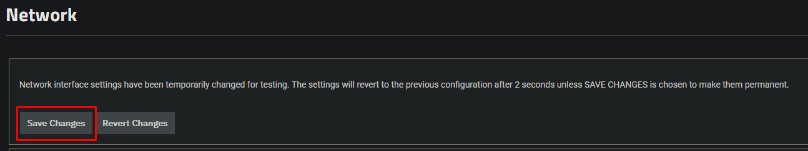
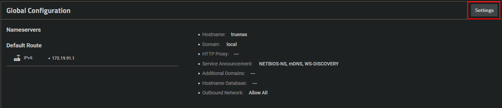
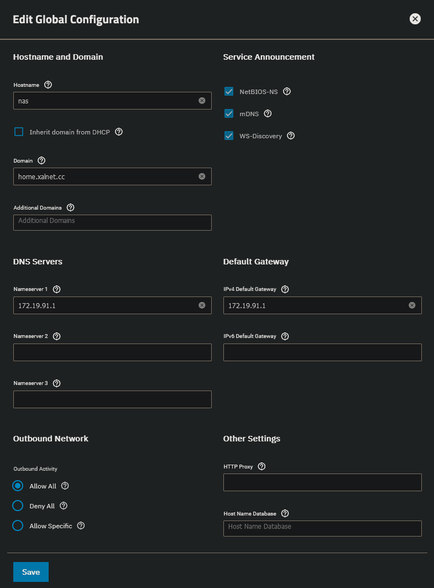

 
Select "Network" in the left menu and edit the network interface.

Disable DHCP and click on "Add".

Enter the IP address and hit "Save".

Enter your default gateway and select "Register".

Click on "Test Changes" to verify your IP settings.

Select "Confirm" and test your changes.

Log on quickly onto the new IP and save the changes. Failing to do so within 60 seconds will roll back the previous settings.

Change the hostname, domain and dns server in the Global Configuration.

