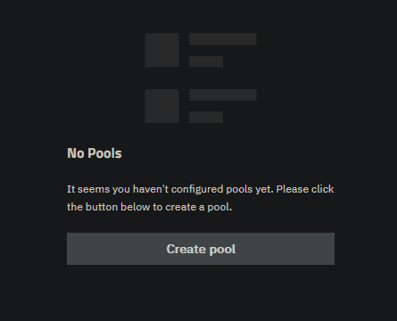
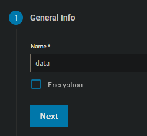
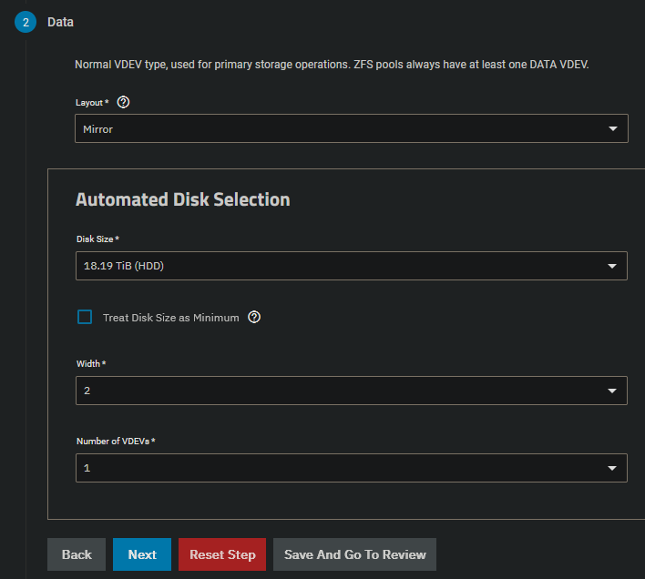
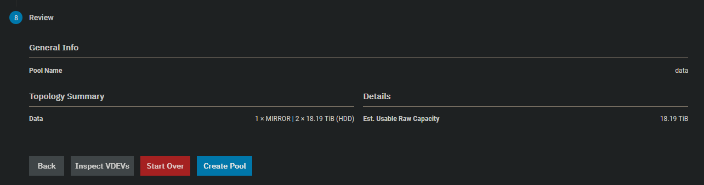
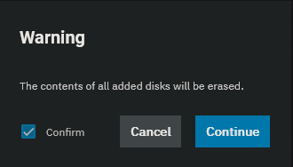

 
Go to storage and select "Create pool"

Enter a name for your storage and select "Encryption" if needed

Select the layout of your pool. In case you have multiple pools and you want to manually select your drives, select them under the advanced options.

As we don't have any other drives we cannot configure any of the optional steps.
Go to review and click "Create Pool".

Confirm that the data will be erased.

