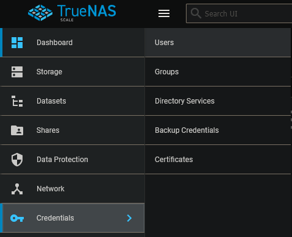
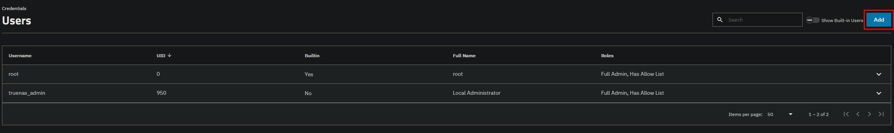
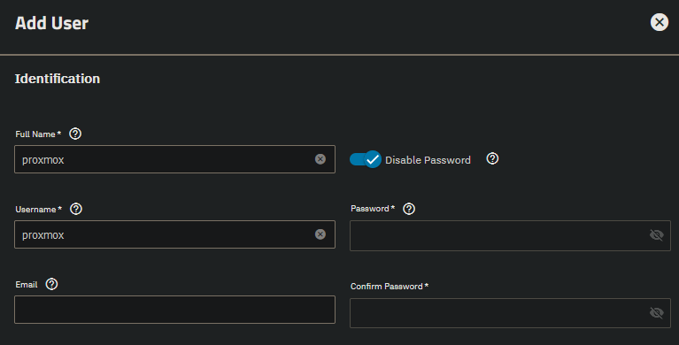
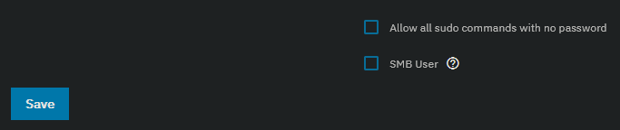

 
Go to Credentials -> Users.

In the top right click on "Add".

Fill in a username and disable the password. We will create a user proxmox for our proxmox NFS share which we will use later on as on the host for extra storage and LXC mount points.

Scroll down, unselect "SMB User" and click on "Save".

