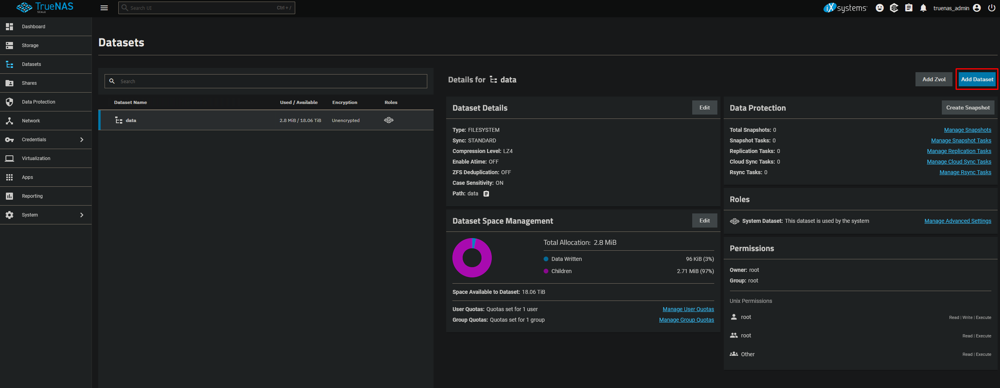
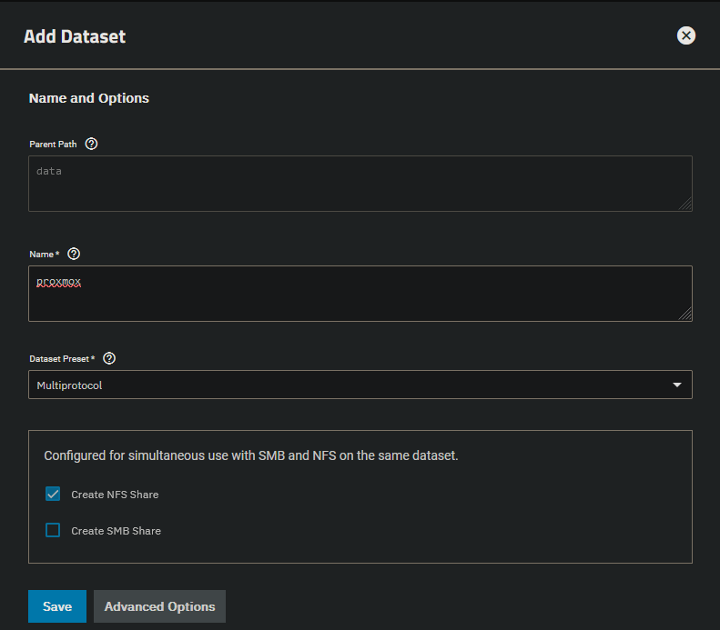
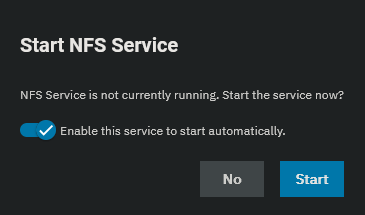

 
Create a sub dataset by clicking "Add Dataset" in the top right. These will be new mount points for network shares.

Enter a name and change the dataset preset to "Multiprotocol". Select the options needed for this dataset.

Start the needed services if they are not running yet.

