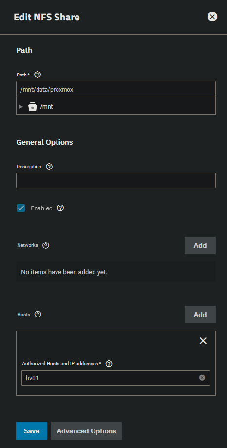
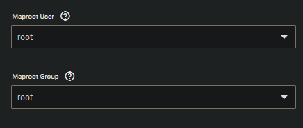

 
In the share tab you can create shares for the created datasets.
As we already created our proxmox NFS share through the dataset creation, we will edit the share now to only allow the connection by hostname.

Under "Advanced Options" set the maptroot user and maproot group to root.

