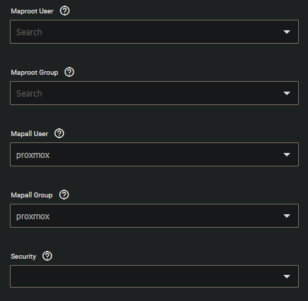

 
In the share tab you can create shares for the created datasets.
As we already created our proxmox NFS share through the dataset creation, we will edit the share now to only allow the connection by hostname.

Under "Advanced Options" set the "Mapall user" and "Mapall group" to proxmox.

Go to System -> Services.

Edit the NFS service and enable "NFSv3 ownership model for NFSv4". We will need this allow the docker containers to access the NFS share.

