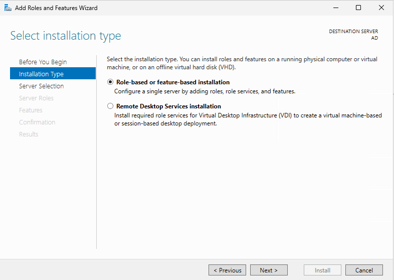
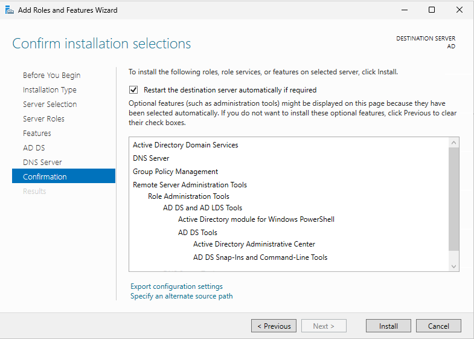
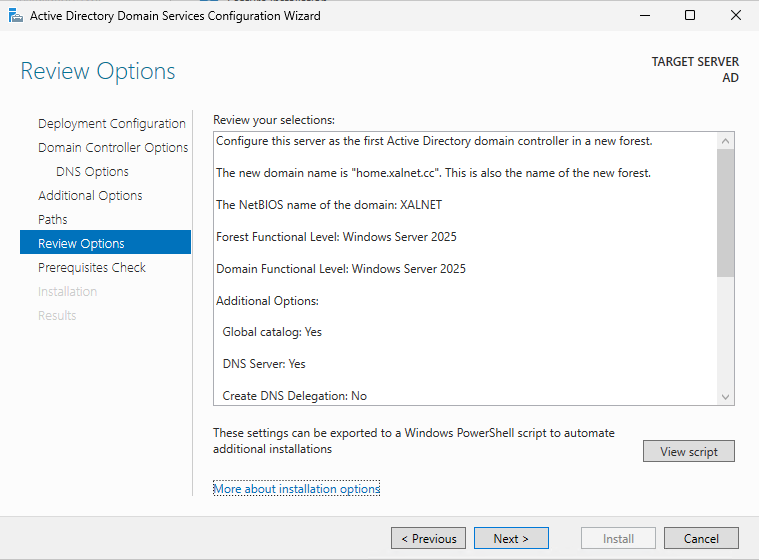

 
Make sure the server is assigned a static IP address and set the DNS server to "127.0.0.1".

Open Server Manager and select "Manage -> Add Roles and Features" in the top right corner.

Select "Role-based or feature-based installation" and click on "Next".

Select your server and click on "Next".

Select "Active Directory Domain Services".

Click on "Add Features".

Select "DNS Server".

Select "Add Features".

Click on "Next".

Click on "Next".

Click on "Next".

Click on "Next".

Select "Restart the destination server automatically if required" and click on "Install".

Click on "Promote this server to a domain controller".

Select "Add a new forest" and choose your root domain name.

Choose your DSRM password. Make sure to keep this password somewhere safe. Click on "Next".

Click on "Next".

Choose a NetBIOS domain name and click on "Next".

Click on "Next".

Click on "Next".

Click on "Install".

After the installation has been completed the server will restart.