 
### DNS Forwarders

Open "DNS Manager". Right lick on your server and select "Properties".

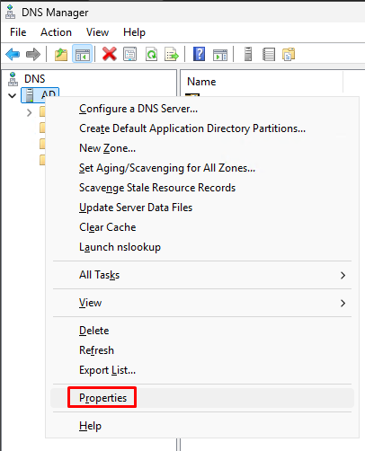

Click on the "Forwarders" tab and click on "Edit".

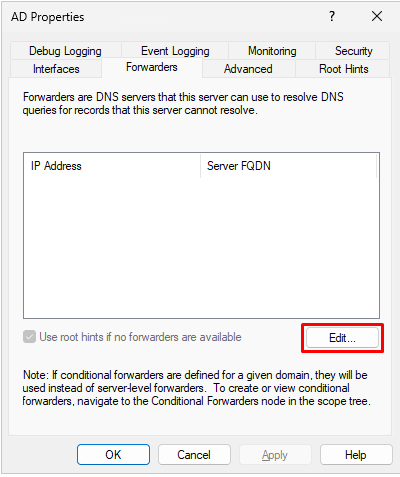

Enter some public DNS servers as forwarders and click on "OK".

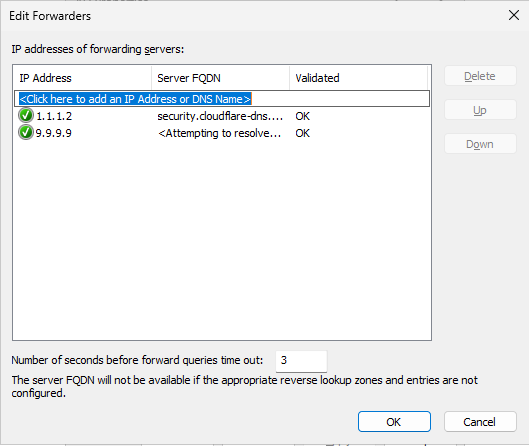

Click on "OK".

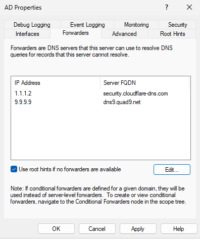

### New domain admin

Create a new domain admin and disable the default one.

Open "Active Directory Users and Computers". Right click on Administrator and select "Copy".

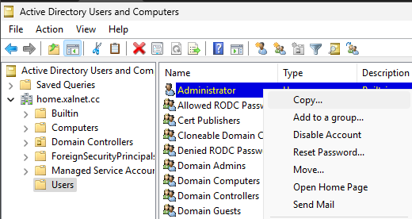

Fill in the domain admin user info. It is advised to only use this user on your domain controller and nowhere else.

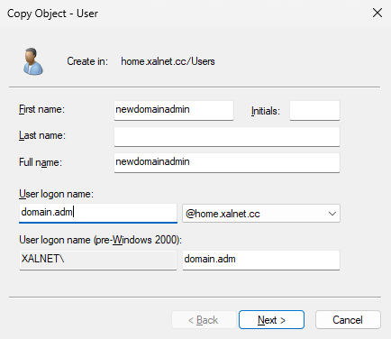

Enter a password and click on "Next" followed up by "Finish".

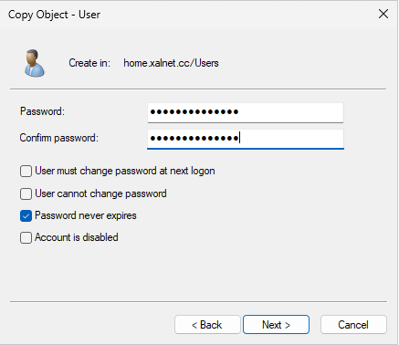

Logout of the server and log in with your new domain admin. Open "Active Users and Computers". Right click on "Administrator" and select "Disable Account".

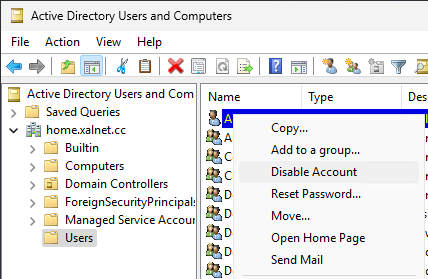

### Basic OU structure

Right click on your domain and click on "New - Organizational Unit".

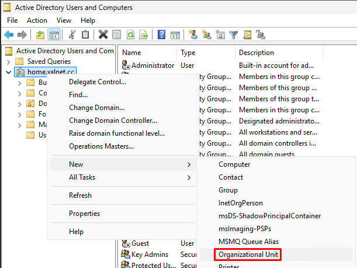

Give the name of your root folder and click on "OK".

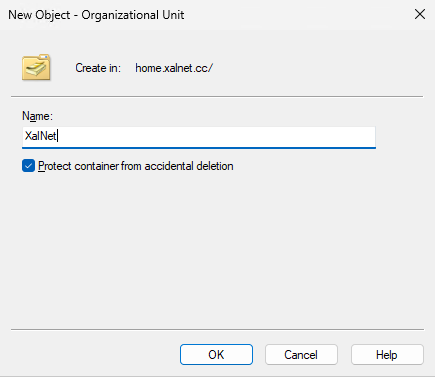

Now right click on your root folder and create more Organizational Units as needed.

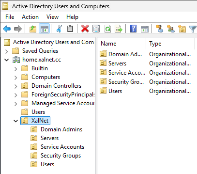

We will use these organizational units to apply policies on different types of accounts and servers. You can split these up even further as needed.
