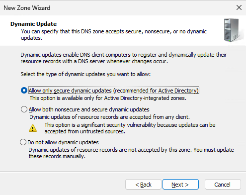

In order to resolve an IP address to a hostname you need to create a reverse lookup zone.
Open DNS Manager and right click on "Reverse Lookup Zones" and select "New Zone".

Click "Next".

Click "Next".

Click "Next".

Enter the network portion of your subnet and click on "Next".

Click on "Next".

Click on "Finish".

Do this for all your private subnets.